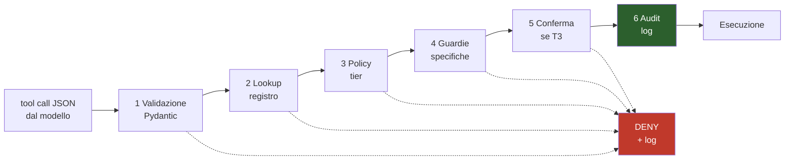

# M2 — Capability Broker

> **Maturità:** P2 Obbediente · **Durata:** 1,5 settimane (8 giorni) · **Tag:** `m2-broker`

---

## Obiettivo

Costruire il componente di sicurezza **prima** degli strumenti che deve controllare.

Questo ordine non è negoziabile. Se si scrive prima l'automazione e si aggiunge la sicurezza dopo, la sicurezza non si aggiunge mai davvero: diventa una serie di controlli sparsi, ognuno aggirabile, nessuno testato.

> **Il principio che regge tutta l'iterazione:** il vincolo "Metis non tocca i file personali" non si applica bloccando `os` e `shutil`. L'LLM non esegue mai Python arbitrario. Si applica **non esponendo alcuno strumento che manipoli file**, e mettendo guardie sui due strumenti che possono farlo di rimbalzo: `subprocess` e la sintesi di tastiera.

---

## Prerequisiti

- [ ] M1 chiuso, macchina a stati funzionante
- [ ] Audit log SQLite creato
- [ ] Logging strutturato attivo

---

## Deliverable

| # | Componente | File |
| :-- | :-- | :-- |
| 1 | Schemi Pydantic di tutti gli strumenti | `metis/llm/schemas.py` |
| 2 | Registro degli strumenti | `metis/tools/registry.py` |
| 3 | Broker a 6 stadi | `metis/security/broker.py` |
| 4 | Policy T0–T3 | `metis/security/policies.py` |
| 5 | Guardie: allowlist app, denylist finestre | `metis/security/guards.py` |
| 6 | Primi strumenti T0 e T1 | `metis/tools/{telemetry,apps,windows}.py` |
| 7 | Kill switch globale | `metis/security/killswitch.py` |
| 8 | **Test suite, copertura ≥ 95%** | `tests/test_broker.py`, `tests/test_guards.py` |

---

## Step operativi

### Giorni 1–2 — Schemi e registro

#### 1.1 Un solo schema, due usi

Il modello Pydantic è **contemporaneamente**:
- la definizione passata a Ollama per l'output strutturato,
- il validatore applicato dal broker.

Una sola fonte di verità, nessuna possibilità di divergenza fra ciò che il modello può produrre e ciò che il broker accetta.

```python
# metis/llm/schemas.py
from typing import Literal, Annotated, Union
from pydantic import BaseModel, Field

class OpenApplication(BaseModel):
    """T1 — Apre un'applicazione dall'allowlist."""
    tool: Literal["open_application"]
    app: Literal["vscode", "github_desktop", "chrome", "spotify"]

class MoveWindowToMonitor(BaseModel):
    """T1 — Sposta una finestra su un altro monitor."""
    tool: Literal["move_window_to_monitor"]
    window_id: int
    monitor: int = Field(..., ge=0, le=3)

class SendEmail(BaseModel):
    """T3 — Invia una email. Conferma OBBLIGATORIA."""
    tool: Literal["send_email"]
    to: str = Field(..., pattern=r"^[^@]+@[^@]+\.[^@]+$")
    subject: str = Field(..., max_length=200)
    body: str = Field(..., max_length=5000)

ToolCall = Annotated[
    Union[OpenApplication, MoveWindowToMonitor, SendEmail, ...],
    Field(discriminator="tool"),
]
```

**Regole di progettazione degli schemi:**

| Regola | Motivo |
| :-- | :-- |
| `Literal` ovunque sia possibile enumerare | Il modello non può nominare ciò che non è nell'enum |
| **Nessun campo di tipo percorso file** | È il meccanismo di sicurezza principale |
| `max_length` su ogni stringa | Evita payload abnormi |
| Vincoli numerici (`ge`, `le`) espliciti | Un `monitor=99` non deve arrivare al codice |
| Discriminated union su `tool` | Validazione deterministica, messaggi d'errore utili |

#### 1.2 Registro — `metis/tools/registry.py`

```python
@dataclass(frozen=True)
class ToolSpec:
    name: str
    tier: Tier                    # T0 | T1 | T2 | T3
    schema: type[BaseModel]
    handler: Callable
    guards: list[Guard]           # guardie aggiuntive

REGISTRY: dict[str, ToolSpec] = {}

def tool(tier: Tier, schema: type[BaseModel], guards: list[Guard] = ()):
    def deco(fn):
        REGISTRY[schema.model_fields["tool"].default] = ToolSpec(...)
        return fn
    return deco
```

Il registro è anche ciò che genera lo schema JSON passato a Ollama: gli strumenti disponibili al modello e quelli accettati dal broker sono **la stessa lista per costruzione**.

---

### Giorni 3–5 — Il broker

#### 2.1 La pipeline a 6 stadi



#### 2.2 Regole implementative

| Regola | Perché |
| :-- | :-- |
| **Un solo punto di ingresso.** `broker.execute(raw_json, context)` | Se ci sono due strade, una delle due non è controllata |
| **Nessuno strumento è chiamabile direttamente.** Gli handler sono privati | Impedisce bypass accidentali durante lo sviluppo |
| **Deny-by-default.** Ogni stadio deve dire sì esplicitamente | Un `KeyError` non deve tradursi in esecuzione |
| **Il rifiuto è sempre loggato**, con motivo | L'audit log è anche il debugger |
| **Nessuna eccezione esce dal broker.** Ritorna un `Result` | Un crash del broker non deve fermare Metis |

#### 2.3 Le policy per livello — `policies.py`

| Livello | Controllo |
| :-- | :-- |
| **T0** | Passa sempre. Log leggero. |
| **T1** | Passa. Log completo. |
| **T2** | Denylist finestre + denylist combinazioni. Log dettagliato con la finestra target. |
| **T3** | **Conferma utente sempre.** Timeout 20 s → rifiuto implicito. |

Regola aggiuntiva di §8.5 della specifica, da implementare già ora:

```python
# Nessuna azione T2 o T3 può originare da un turno che contiene
# contenuto web appena recuperato.
if context.has_untrusted_content and spec.tier in (Tier.T2, Tier.T3):
    return Result.denied("azione non ammessa dopo recupero web")
```

Il modulo web arriva in M5, ma la regola si scrive ora: aggiungerla dopo significa dimenticarla.

#### 2.4 Le guardie — `guards.py`

**Allowlist applicazioni:**

```toml
# config/apps.toml
[apps]
vscode          = "C:/Users/Marco/AppData/Local/Programs/Microsoft VS Code/Code.exe"
github_desktop  = "C:/Users/Marco/AppData/Local/GitHubDesktop/GitHubDesktop.exe"
chrome          = "C:/Program Files/Google/Chrome/Application/chrome.exe"
```

```python
def launch(app_key: str) -> None:
    path = ALLOWLIST[app_key]          # KeyError → deny, mai fallback
    subprocess.Popen([path])           # lista, MAI shell=True, MAI stringa
```

Doppia barriera: il `Literal` nello schema impedisce al modello di nominare altro, **e** l'allowlist verifica comunque. Ridondanza voluta.

**Denylist finestre (T2):**

```python
DENY_PROCESSES = {
    "explorer.exe", "cmd.exe", "powershell.exe", "pwsh.exe",
    "WindowsTerminal.exe", "regedit.exe", "taskmgr.exe",
}
DENY_WINDOW_CLASSES = {"#32770"}       # dialoghi file

def check_foreground() -> Guard.Result:
    hwnd = win32gui.GetForegroundWindow()
    pid = win32process.GetWindowThreadProcessId(hwnd)[1]
    proc = psutil.Process(pid).name()
    if proc in DENY_PROCESSES:
        return deny(f"finestra in primo piano non consentita: {proc}")
    ...
```

> **Va verificata immediatamente prima di ogni evento di input, non una volta per turno.** La finestra in primo piano può cambiare tra la decisione e l'esecuzione.

**Denylist combinazioni:**

```python
DENY_HOTKEYS = [
    {"shift", "delete"},        # eliminazione definitiva
    {"win", "r"},               # esegui
    {"ctrl", "shift", "enter"}, # esecuzione elevata
]
```

#### 2.5 Kill switch

Hotkey globale `Ctrl+Alt+Shift+M`: sospende immediatamente ogni capacità T2 e T3. Lo stato è visibile (in M3 diventa un indicatore in GUI, in M2 basta un log e un beep).

---

### Giorno 6 — Primi strumenti e tool calling

#### 3.1 Strumenti da implementare in M2

Solo T0 e T1. Gli strumenti T2 arrivano in M4, **dopo** che il broker è testato.

| Strumento | Tier | Nota |
| :-- | :-- | :-- |
| `get_telemetry` | T0 | Riusa il codice di M0 |
| `list_windows` | T0 | `pywinctl` |
| `get_active_window` | T0 | Usato anche dalle guardie |
| `open_application` | T1 | Allowlist |

#### 3.2 Tool calling con output strutturato

```python
schema = ToolCall.model_json_schema()
resp = ollama.chat(
    model=MODEL,
    messages=[{"role": "system", "content": TOOL_PROMPT}, *history],
    format=schema,                 # output strutturato nativo
    think=False,
    options={"temperature": 0.15}, # §7.1 — determinismo
)
```

**Su fallimento di validazione: un solo tentativo di riparazione**, con il messaggio di errore Pydantic reiniettato nel prompt. Poi rifiuto esplicito. Mai un secondo tentativo alla cieca: se il modello sbaglia due volte, sta sbagliando l'intento, non la sintassi.

#### 3.3 Fast-path

I comandi noti non passano dall'LLM (§6.2 della specifica: 5–30 ms contro 400+). Il router confronta il testo trascritto con `config/commands.json` e, in caso di corrispondenza, costruisce la tool call direttamente.

Il fast-path **passa comunque dal broker**. Nessuna scorciatoia salta la validazione.

---

### Giorni 7–8 — Test suite

Il broker è **l'unico modulo del progetto con un requisito di copertura**: ≥ 95%. È l'unico componente il cui fallimento è pericoloso anziché fastidioso.

#### 4.1 Casi positivi

| Test | Atteso |
| :-- | :-- |
| T0 valido | Eseguito, loggato |
| T1 valido con app in allowlist | Eseguito, loggato |
| T3 valido con conferma | Eseguito, `confirmed=1` |

#### 4.2 Casi negativi

| Test | Atteso |
| :-- | :-- |
| JSON malformato | Deny stadio 1 |
| Campo mancante | Deny stadio 1 |
| `monitor=99` (fuori range) | Deny stadio 1 |
| Stringa oltre `max_length` | Deny stadio 1 |
| `tool` inesistente | Deny stadio 2 |
| T3 con conferma negata | Deny stadio 5 |
| T3 con timeout conferma | Deny stadio 5 |
| Kill switch attivo + T2 | Deny stadio 3 |

#### 4.3 Casi avversariali

I più importanti. Simulano un modello che tenta di aggirare i vincoli — per allucinazione o per prompt injection.

| Test | Atteso |
| :-- | :-- |
| `open_application(app="cmd.exe")` | Deny: non è nel `Literal` |
| `open_application(app="../../../windows/system32/cmd.exe")` | Deny |
| `type_text` con Esplora risorse in primo piano | Deny stadio 4 |
| `press_hotkey(["shift","delete"])` | Deny stadio 4 |
| Tool call inventato `delete_file(...)` | Deny stadio 2 |
| Tool call inventato `run_command(...)` | Deny stadio 2 |
| T2 in un turno con `has_untrusted_content=True` | Deny stadio 3 |
| Finestra cambia tra check e esecuzione | Deny: la guardia è ri-valutata |

#### 4.4 Verifica per ispezione

Due controlli che non si automatizzano ma si fanno una volta e si annotano:

- [ ] **Nessuno strumento del registro accetta un percorso di file come parametro.** Verificato scorrendo tutti gli schemi.
- [ ] **Nessun handler è raggiungibile senza passare dal broker.** Verificato cercando le chiamate dirette.

---

## Criteri di uscita

- [ ] Copertura test sul broker ≥ **95%** (`pytest --cov=metis.security --cov=metis.tools.registry`)
- [ ] Tutti i casi negativi rifiutati e loggati con motivo
- [ ] Tutti i casi avversariali rifiutati
- [ ] **NFR-9: zero azioni T3 senza conferma** su 50 tentativi, inclusi quelli avversariali
- [ ] Nessuno strumento accetta un percorso di file — verificato per ispezione
- [ ] Nessun handler chiamabile fuori dal broker — verificato per ispezione
- [ ] `apri_applicazione` funziona su VS Code e GitHub Desktop
- [ ] Il fast-path passa dal broker come qualunque altra chiamata
- [ ] Kill switch sospende T2 e T3 entro 100 ms
- [ ] `git tag m2-broker`

---

## Fuori ambito per M2

| Non si fa | Arriva in |
| :-- | :-- |
| Strumenti T2 (mouse, tastiera) | **M4** — dopo che il broker è testato |
| Automazione browser | M4 |
| Ricerca web | M5 |
| Email, scheduler, Home Assistant | M6 |
| GUI per le conferme (in M2 la conferma è da console) | M3 |

---

## Rischi specifici di M2

| Rischio | Sintomo | Contromisura |
| :-- | :-- | :-- |
| Handler chiamati direttamente durante lo sviluppo | Il broker sembra funzionare ma è bypassato | Handler privati, verifica per ispezione nei criteri di uscita |
| Guardia della finestra valutata troppo presto | Race condition: la finestra cambia prima dell'esecuzione | Valutare immediatamente prima di ogni evento, non per turno |
| `subprocess` con stringa invece di lista | Injection tramite argomenti | Test dedicato; mai `shell=True` |
| Eccezione non gestita nel broker | Metis si blocca su una tool call malformata | Il broker ritorna `Result`, non solleva mai |
| Conferma T3 accettata per default al timeout | Azioni irreversibili non volute | Timeout = rifiuto implicito, testato |
| Copertura raggiunta con test banali | 95% di copertura, zero sicurezza | I casi avversariali di §4.3 sono obbligatori, non opzionali |

---

## Handoff a M3 e M4

M2 consegna:

1. **Il perimetro d'azione di Metis**, definito ed esecutivo. Da qui, aggiungere uno strumento significa aggiungere una riga al registro e uno schema: la sicurezza è già applicata.
2. **L'audit log popolato**, che in M3 diventa un pannello della GUI.
3. **Il flusso di conferma T3**, che in M3 passa da console a finestra di dialogo.
4. **Il vincolo per M4:** ogni strumento T2 nasce dentro il broker. Non esiste un percorso alternativo da scrivere "provvisoriamente".
