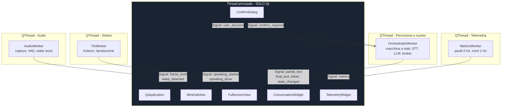

# M3 — Interfaccia Grafica

> **Maturità:** P3 Visibile · **Durata:** 2 settimane (10 giorni) · **Tag:** `m3-gui`

---

## Obiettivo

Dare a Metis **una faccia che non si blocca**.

Il rischio dominante di questa iterazione non è estetico: è il **freezing dell'UI**. Un'interfaccia Qt che chiama codice di inferenza sul thread principale si congela per secondi a ogni risposta, e nessuna quantità di lavoro grafico successivo rimedia a un'architettura dei thread sbagliata. Per questo M3 comincia dal modello di concorrenza, non dai widget.

---

## Prerequisiti

- [ ] M2 chiuso, broker testato
- [ ] Macchina a stati con segnali osservabili
- [ ] Audit log popolato
- [ ] Metriche `TurnMetrics` prodotte a ogni turno

---

## Deliverable

| # | Componente | File |
| :-- | :-- | :-- |
| 1 | Applicazione PySide6 e topologia dei thread | `metis/gui/app.py`, `metis/gui/workers/` |
| 2 | Modalità Minimal (overlay) | `metis/gui/minimal_view.py` |
| 3 | Modalità Fullscreen (control room) | `metis/gui/fullscreen_view.py` |
| 4 | Conversazione con trascrizione live | `metis/gui/widgets/conversation.py` |
| 5 | Dashboard telemetria | `metis/gui/widgets/telemetry.py` |
| 6 | Dialogo di conferma T3 | `metis/gui/widgets/confirm.py` |
| 7 | Visualizzatore audit log | `metis/gui/widgets/audit_view.py` |

---

## Step operativi

### Giorni 1–3 — Topologia dei thread

#### 1.1 La regola che regge tutto

> **I widget si toccano solo dal thread principale.** Ogni comunicazione da un thread secondario passa per un `Signal`. Non esistono eccezioni, nemmeno "solo per questa etichetta".

Violare questa regola non produce un errore immediato: produce crash sporadici settimane dopo, in situazioni non riproducibili. È il motivo per cui la §4.1 della bozza originale aveva ragione a insistere sui Segnali/Slot.

#### 1.2 Topologia



#### 1.3 Il pattern corretto — worker `QObject`, non sottoclasse di `QThread`

```python
class OrchestratorWorker(QObject):
    partial_text  = Signal(str)
    final_text    = Signal(str)
    token         = Signal(str)
    state_changed = Signal(str)
    confirm_required = Signal(dict)
    error         = Signal(str)

    @Slot()
    def run(self):
        ...        # ciclo di lavoro, nessun riferimento a widget

# montaggio
thread = QThread()
worker = OrchestratorWorker()
worker.moveToThread(thread)
thread.started.connect(worker.run)
worker.final_text.connect(conversation.append_user)   # slot sul thread principale
thread.start()
```

> **Perché non sottoclassare `QThread`:** sottoclassando, i metodi dell'oggetto restano affiliati al thread *creatore*, non a quello nuovo. È l'errore più comune con Qt e produce esattamente i bug che si cercava di evitare.

#### 1.4 Il caso della conferma T3 — l'unico flusso bidirezionale

Il broker gira sul thread dell'orchestratore, ma la conferma la dà l'utente sul thread della GUI. Il worker **non può bloccarsi** aspettando, né chiamare un dialogo.

Soluzione: `QWaitCondition` sul lato worker, sbloccata dallo slot che riceve la decisione.

```python
# lato worker
self.confirm_required.emit(payload)
with QMutexLocker(self._mutex):
    ok = self._wait.wait(self._mutex, 20_000)   # timeout 20 s = rifiuto
    return self._decision if ok else False
```

Il timeout della `QWaitCondition` e il timeout del broker devono essere **lo stesso valore**, letto dalla stessa configurazione.

#### 1.5 Throttling dei segnali

Lo streaming dei token emette un segnale ogni pochi millisecondi. Collegarlo direttamente a un widget di testo satura la coda eventi di Qt e produce scatti.

| Segnale | Frequenza grezza | Strategia |
| :-- | :-- | :-- |
| `token` | ~60/s | Accumulo in buffer, flush a 20 Hz |
| `frame_level` (VU meter) | ~30/s | Flush a 15 Hz |
| `metrics` | 2 Hz / 1 Hz | Nessun throttling necessario |

---

### Giorni 4–5 — Modalità Minimal

Widget compatto, sempre in primo piano, pensato per stare in un angolo durante il lavoro.

#### 2.1 Caratteristiche

```python
self.setWindowFlags(
    Qt.FramelessWindowHint
    | Qt.WindowStaysOnTopHint
    | Qt.Tool                      # non appare nella barra delle applicazioni
)
self.setAttribute(Qt.WA_TranslucentBackground)
```

#### 2.2 Contenuto

| Elemento | Nota |
| :-- | :-- |
| **Indicatore di stato** | Un colore per stato della macchina §5. È l'informazione più importante del widget |
| VU meter | Livello audio in ingresso |
| Ultima frase trascritta | Una riga, troncata |
| Pulsante push-to-talk | Equivalente all'hotkey |
| Indicatore kill switch | Visibile solo quando attivo |

#### 2.3 Mappa dei colori di stato

| Stato | Colore | Significato per l'utente |
| :-- | :-- | :-- |
| `DORMIENTE` | grigio tenue | Non sta ascoltando |
| `IN_ASCOLTO` | blu | Sveglio, in attesa |
| `TRASCRIZIONE` | blu pulsante | Ti sta sentendo |
| `ELABORAZIONE` / `GENERAZIONE` | ambra | Sta pensando |
| `PARLATO` | verde | Sta parlando |
| `ATTESA_CONFERMA` | arancione | **Aspetta te** |
| `ERRORE` | rosso | Qualcosa non va |

L'indicatore va reso leggibile **di sbieco e a due metri di distanza**: è il caso d'uso reale di un overlay.

#### 2.4 Trascinabile, posizione persistita

Frameless significa gestire il drag a mano (`mousePressEvent` / `mouseMoveEvent`). La posizione si salva in `config/settings.toml` alla chiusura.

---

### Giorni 6–8 — Modalità Fullscreen

La control room. Layout a tre colonne.

```
┌──────────────────────────────────────────────────────────────────┐
│  METIS            [stato]  [kill switch]      [Minimal] [Chiudi] │
├──────────────────┬─────────────────────────┬─────────────────────┤
│                  │                         │  TELEMETRIA         │
│  CONVERSAZIONE   │   Parziali live (STT)   │  CPU  ████░░ 42%    │
│                  │   ─────────────────     │  RAM  ██████ 18 GB  │
│  Utente:  ...    │   Risposta in stream    │  VRAM ███████ 6,8   │
│  Metis:   ...    │                         │  GPU  68 C          │
│                  ├─────────────────────────┤                     │
│                  │  CONFERMA RICHIESTA     │  LATENZA            │
│                  │  send_email a ...       │  TTFT   312 ms      │
│                  │  [Approva]  [Nega] 18s  │  tok/s  61          │
│                  │                         │  e2e p50  1,14 s    │
├──────────────────┴─────────────────────────┤  e2e p95  1,62 s    │
│  AUDIT LOG                                 ├─────────────────────┤
│  12:04:31  T1 open_application  vscode  ok │  COMANDI CUSTOM     │
│  12:05:02  T3 send_email        denied     │  [editor]           │
└────────────────────────────────────────────┴─────────────────────┘
```

#### 3.1 Widget conversazione

- Append incrementale, **non** ricostruzione del documento a ogni token (costoso e fa saltare lo scroll)
- Auto-scroll disattivato se l'utente ha scrollato verso l'alto
- Parziali Vosk in grigio, testo finale Whisper in chiaro: mostra visivamente la differenza fra "ti sto sentendo" e "ho capito"

#### 3.2 Dashboard telemetria

| Widget | Sorgente | Frequenza | Nota |
| :-- | :-- | :-- | :-- |
| CPU %, RAM | `psutil` | 2 Hz | — |
| VRAM, temperatura GPU | `nvidia-ml-py` | **1 Hz** | La query NVML è costosa: non alzare la frequenza |
| TTFT, tok/s | `TurnMetrics` | Per turno | — |
| Latenza e2e p50/p95 | Finestra scorrevole ultimi 50 turni | Per turno | Sono gli NFR-1 e NFR-2 sotto gli occhi |

**Soglia VRAM:** al superamento di 7,5 GB (§3.2 della specifica) l'indicatore diventa rosso e viene emesso un avviso.

#### 3.3 Dialogo di conferma T3

È l'unico punto dell'interfaccia dove un errore ha conseguenze. Requisiti:

- mostra **strumento, argomenti completi e tier**, non un riassunto
- countdown visibile del timeout
- **nessun pulsante di default**: né Invio né Esc devono approvare
- "Nega" è il pulsante che riceve il focus

#### 3.4 Visualizzatore audit log

Tabella filtrabile per tier ed esito, in coda al file. Serve tanto all'utente quanto allo sviluppo: durante M4 sarà il modo principale per capire perché un'azione è stata rifiutata.

---

### Giorni 9–10 — Profiling e rifinitura

#### 4.1 Verifica NFR-8

| Test | Procedura | Soglia |
| :-- | :-- | :-- |
| Freeze sotto inferenza | 20 turni completi con profiler attivo | Nessun blocco dell'event loop > 100 ms |
| Frame rate | Durante generazione + telemetria attiva | ≥ 30 fps |
| Accuratezza telemetria | Confronto con `nvidia-smi` | Scarto < 5% |

Metodo semplice ed efficace per misurare il blocco dell'event loop: un `QTimer` a 16 ms che registra il ritardo effettivo rispetto al previsto. Ogni ritardo > 100 ms è un freeze.

#### 4.2 Passaggio tra modalità

Il cambio Minimal ↔ Fullscreen **non deve perdere stato**: conversazione, metriche e stato della macchina restano. Le due viste sono due proiezioni dello stesso modello, non due applicazioni.

#### 4.3 Verifica per ispezione

- [ ] **Nessun accesso a widget da thread secondari.** Cercare nel codice dei worker ogni riferimento a oggetti della GUI: deve essere zero.

---

## Criteri di uscita

- [ ] **NFR-8:** nessun freeze > 100 ms durante l'inferenza, misurato col timer di §4.1
- [ ] ≥ 30 fps durante generazione con telemetria attiva
- [ ] Nessun accesso ai widget da thread secondari — verificato per ispezione
- [ ] Passaggio Minimal ↔ Fullscreen senza perdita di stato
- [ ] Metriche in dashboard coincidono con `nvidia-smi` entro il 5%
- [ ] Il dialogo di conferma T3 non può essere approvato con Invio o Esc
- [ ] Il timeout della conferma in GUI coincide con quello del broker
- [ ] I parziali Vosk e il finale Whisper sono distinguibili a colpo d'occhio
- [ ] L'indicatore di stato è leggibile a due metri
- [ ] `git tag m3-gui`

---

## Fuori ambito per M3

| Non si fa | Arriva in |
| :-- | :-- |
| Editor funzionante dei comandi custom (solo il contenitore) | M4 |
| Strumenti T2 | M4 |
| Grafici storici della telemetria | M7, se avanza tempo |
| Temi, personalizzazione estetica | Dopo la V1.0 |
| Tray icon e autostart | M7 |

---

## Rischi specifici di M3

| Rischio | Sintomo | Contromisura |
| :-- | :-- | :-- |
| **`QThread` sottoclassato** | Crash sporadici non riproducibili | Pattern worker `QObject` + `moveToThread`, sempre |
| Widget toccato da thread secondario | Idem, anche mesi dopo | Verifica per ispezione nei criteri di uscita |
| Streaming token senza throttling | Interfaccia a scatti, CPU alta | Buffer + flush a 20 Hz |
| Telemetria NVML a frequenza troppo alta | Consumo CPU e latenza di inferenza | Massimo 1 Hz |
| Deadlock sulla conferma T3 | Metis si blocca per sempre su un'azione | `QWaitCondition` **con timeout**, mai attesa indefinita |
| Conferma approvabile con Invio | Azione T3 non voluta per un tasto premuto per abitudine | Nessun pulsante di default, focus su "Nega" |
| Ricostruzione del documento a ogni token | Scroll che salta, CPU alta | Append incrementale |

---

## Handoff a M4

M3 consegna:

1. **Visibilità.** Da qui in avanti il debug dell'automazione si fa guardando l'audit log in GUI, non leggendo file.
2. **Il flusso di conferma completo**, dalla richiesta del broker al pulsante. M4 lo userà per ogni azione T3.
3. **Il contenitore dell'editor dei comandi custom**, che M4 riempie.
4. **La misura di reattività**, che diventa un test di regressione: se M4 introduce un'operazione bloccante, NFR-8 lo rileva.
