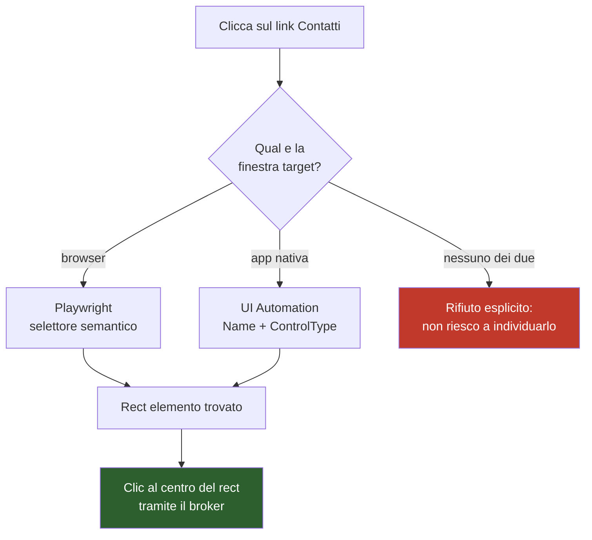

# M4 — Automazione del PC

> **Maturità:** P4 Operativo · **Durata:** 1,5 settimane (8 giorni) · **Tag:** `m4-automation`

---

## Obiettivo

Far sì che Metis **controlli davvero il computer**: finestre su monitor multipli, clic su elementi reali, automazione del browser.

È l'iterazione in cui i sei comandi vocali della bozza originale devono funzionare. Ed è la prima in cui Metis può fare danni — motivo per cui arriva **dopo** M2 e non prima.

> **Vincolo d'ordine:** ogni strumento T2 di questa iterazione nasce dentro il broker. Non si scrive un percorso "provvisorio" che salti la validazione, nemmeno per provare.

---

## Prerequisiti

- [ ] M2 chiuso, broker con copertura ≥ 95%
- [ ] M3 chiuso, conferme T3 funzionanti in GUI
- [ ] Denylist finestre implementata e testata
- [ ] Almeno due monitor collegati, **possibilmente con scaling DPI diverso** (è il caso che rompe tutto)

---

## Deliverable

| # | Componente | File |
| :-- | :-- | :-- |
| 1 | Consapevolezza DPI e geometria monitor | `metis/tools/display.py` |
| 2 | Gestione finestre multi-monitor | `metis/tools/windows.py` |
| 3 | Input sintetico T2 con guardie | `metis/tools/input.py` |
| 4 | Risoluzione elementi via UI Automation | `metis/tools/uia.py` |
| 5 | Automazione browser | `metis/tools/browser.py` |
| 6 | Memoria comandi custom + editor GUI | `metis/memory/commands.py` |

---

## Step operativi

### Giorni 1–2 — DPI e geometria dei monitor

Il passaggio che, se saltato, fa fallire in modo subdolo tutto il resto dell'iterazione.

#### 1.1 Il problema

Con monitor a scaling diverso (es. 4K al 150% + 1080p al 100%), Windows mente alle applicazioni non consapevoli: restituisce coordinate virtualizzate. Il risultato è che `pyautogui` clicca **sistematicamente nel punto sbagliato** sul monitor secondario, con un errore proporzionale alla differenza di scaling.

Peggio: il bug non si manifesta sul monitor primario, quindi passa i test superficiali.

#### 1.2 La soluzione — prima di tutto il resto

```python
# metis/tools/display.py
import ctypes

DPI_AWARENESS_CONTEXT_PER_MONITOR_AWARE_V2 = ctypes.c_void_p(-4)

def set_dpi_awareness() -> None:
    ctypes.windll.user32.SetProcessDpiAwarenessContext(
        DPI_AWARENESS_CONTEXT_PER_MONITOR_AWARE_V2
    )
```

> **Va chiamata prima di creare la `QApplication` e prima di qualunque import che tocchi il display.** Se Qt inizializza per primo, il contesto DPI è già fissato e la chiamata non ha effetto.

#### 1.3 Enumerazione dei monitor

`pyautogui` ha limiti noti oltre il display primario e con coordinate negative (monitor a sinistra o sopra il primario). Usare `mss` per la geometria:

```python
import mss
with mss.mss() as sct:
    # sct.monitors[0] = area virtuale totale
    # sct.monitors[1..n] = singoli monitor, con left/top anche NEGATIVI
    ...
```

#### 1.4 Tabella di verifica geometria — da compilare

| Monitor | Risoluzione | Scaling | left | top | Coordinate negative |
| :-- | :-- | :-- | :-- | :-- | :-- |
| 1 (primario) | ___ | ___ | 0 | 0 | no |
| 2 | ___ | ___ | ___ | ___ | ⬜ |

Se una coordinata `left` o `top` è negativa, va testato **esplicitamente** il posizionamento su quel monitor.

---

### Giorni 3–4 — Gestione finestre

#### 2.1 Strumenti T1

```python
@tool(tier=Tier.T1, schema=MoveWindowToMonitor)
def move_window_to_monitor(window_id: int, monitor: int) -> None:
    ...
```

| Strumento | Tier |
| :-- | :-- |
| `list_windows` | T0 (già in M2) |
| `move_window_to_monitor` | T1 |
| `resize_window` | T1 |
| `minimize_window` / `maximize_window` / `focus_window` | T1 |

#### 2.2 Algoritmo di spostamento

Non basta impostare `left` e `top`: con scaling diverso la finestra va anche **ridimensionata proporzionalmente**, altrimenti su un monitor al 100% una finestra proveniente da uno al 150% appare minuscola.

```
1. leggi rect corrente e monitor di appartenenza
2. calcola posizione relativa (frazione di larghezza/altezza) nel monitor sorgente
3. calcola rect target sul monitor di destinazione, applicando il rapporto di scaling
4. sposta, poi ridimensiona (in questo ordine: Windows riaggancia il DPI allo spostamento)
5. verifica il rect ottenuto e correggi una volta se discosta
```

Il passo 5 non è paranoia: Windows può aggiustare il rect dopo lo spostamento se la finestra ha vincoli di dimensione minima.

#### 2.3 Identificazione della finestra "questa"

Il comando *"sposta questa finestra sullo schermo a destra"* richiede di sapere cosa sia "questa". Regola:

| Situazione | "questa finestra" è |
| :-- | :-- |
| Caso normale | La finestra in primo piano **al momento del wake word**, non al momento dell'esecuzione |
| Se il primo piano è Metis stesso | La finestra precedente nello Z-order |

La distinzione conta: tra il wake word e l'esecuzione passano 1–2 secondi, e il focus può cambiare. Il valore va catturato all'ingresso nello stato `IN_ASCOLTO` e messo nello slot `ultima_finestra` (§10.2 della specifica).

---

### Giorni 5–6 — Input sintetico e risoluzione elementi

#### 3.1 Strumenti T2 — le guardie sono già pronte

Il lavoro di sicurezza è stato fatto in M2. Qui si collegano gli handler.

| Strumento | Guardie applicate |
| :-- | :-- |
| `click_element` | Denylist finestre |
| `type_text` | Denylist finestre |
| `press_hotkey` | Denylist finestre + denylist combinazioni |
| `scroll` | — |
| `drag` | Denylist finestre |

**Test obbligatorio:** aprire Esplora risorse, chiedere a Metis di digitare qualcosa, verificare che rifiuti con il messaggio in persona.

#### 3.2 Il problema delle coordinate — e come si risolve

La bozza originale specificava *"clic sulle coordinate target"* senza dire chi le calcola. La risposta di M4: **nessuno**. Le coordinate grezze sono vietate come parametro di strumento.



> **Il rifiuto esplicito è un risultato corretto, non un fallimento.** Meglio "non riesco a individuare quel link" che un clic a caso in mezzo allo schermo.

#### 3.3 UI Automation — `metis/tools/uia.py`

```python
import uiautomation as auto

def find_element(name: str, control_type: str | None = None,
                 timeout: float = 2.0):
    """Cerca per Name nella finestra in primo piano.
    Ritorna None se non trovato: il chiamante rifiuta."""
    ...
```

Ordine di ricerca: corrispondenza esatta del `Name` → corrispondenza parziale → `AutomationId`. **Mai** ricerca fuzzy: un match sbagliato clicca sulla cosa sbagliata, che è peggio di non cliccare.

#### 3.4 Automazione browser — `metis/tools/browser.py`

Playwright è la risposta per tutto ciò che è web, che è il caso d'uso principale della bozza.

**Decisione architetturale:** connessione a un Chrome **già in esecuzione** via CDP, non lancio di un browser separato.

```python
# Chrome va avviato con --remote-debugging-port=9222
browser = playwright.chromium.connect_over_cdp("http://localhost:9222")
```

| Approccio | Pro | Contro |
| :-- | :-- | :-- |
| **CDP su Chrome esistente** ✅ | Opera sulle tue schede reali, sessioni e login attivi | Richiede il flag all'avvio, gestito dall'allowlist di `open_application` |
| Browser Playwright dedicato | Isolato, pulito | Profilo separato: nessun login, nessuna cronologia. Inutile per l'uso reale |

Il flag `--remote-debugging-port=9222` si aggiunge alla voce `chrome` in `config/apps.toml`.

---

### Giorni 7–8 — Comandi custom e accettazione

#### 4.1 `config/commands.json`

```json
{
  "comandi": [
    {
      "id": "inizia_lavoro",
      "frasi": ["inizia a lavorare", "si comincia", "modalità lavoro"],
      "azioni": [
        {"tool": "open_application", "app": "vscode"},
        {"tool": "open_application", "app": "github_desktop"}
      ],
      "risposta": "Ambiente di sviluppo pronto. Le danze abbiano inizio."
    }
  ]
}
```

**Regole:**
- Le azioni sono **tool call, non script.** Passano dal broker come qualunque altra chiamata.
- Più frasi per comando: il matching è su forma normalizzata (minuscole, senza punteggiatura, senza accenti).
- La `risposta` è opzionale: se assente, Metis genera una conferma dall'LLM.

#### 4.2 Editor in GUI

Riempie il contenitore predisposto in M3. Requisiti:

- aggiunta, modifica ed eliminazione di un comando
- **validazione contro il registro**: non si può salvare un comando che invoca uno strumento inesistente o con argomenti non conformi allo schema
- **ricarica a caldo**: nessun riavvio dopo il salvataggio

#### 4.3 I sei comandi di accettazione

Sono i criteri di uscita veri di M4. Vanno dalla bozza originale, e devono funzionare.

| # | Comando vocale | Verifica |
| :-- | :-- | :-- |
| 1 | "Hey Metis, inizia a lavorare" | VS Code + GitHub Desktop aperti |
| 2 | "Sposta questa finestra sullo schermo a destra" | Riposizionamento corretto, **anche con scaling DPI diverso** |
| 3 | "Clicca sul link \[nome\]" | Risolto via UIA o Playwright, mai via coordinate indovinate |
| 4 | "Aprimi le news dei mercati" | Browser su investing.com |
| 5 | "Massimizza Chrome" | Finestra massimizzata sul monitor corrente |
| 6 | "Metti Chrome sull'altro schermo e massimizzala" | Comando **composto**: due azioni in sequenza, entrambe dal broker |

Il sesto è il più interessante: mette alla prova la capacità del modello di produrre più tool call coerenti in un turno, e del broker di validarle in sequenza mantenendo lo slot `ultima_finestra`.

---

## Criteri di uscita

- [ ] `set_dpi_awareness()` chiamata prima di `QApplication`, verificato per ispezione
- [ ] Tabella di geometria dei monitor compilata, coordinate negative gestite
- [ ] I sei comandi di accettazione funzionano
- [ ] Comando 2 verificato **su entrambe le direzioni** e con scaling DPI diverso
- [ ] Digitare in Esplora risorse viene **rifiutato** con messaggio in persona
- [ ] `press_hotkey(["shift","delete"])` rifiutato in qualunque contesto
- [ ] Clic su elemento non individuabile → rifiuto esplicito, **nessun clic a caso**
- [ ] Nuovo comando custom aggiungibile da GUI senza riavvio
- [ ] Comando custom con strumento inesistente → salvataggio rifiutato
- [ ] Ogni azione T2 compare nell'audit log con la finestra target
- [ ] **NFR-8 non è regredito:** nessun freeze > 100 ms (le operazioni su finestre sono bloccanti: vanno sul worker)
- [ ] `git tag m4-automation`

### Decision gate D2

| Decisione | Criterio | Alternativa |
| :-- | :-- | :-- |
| Strategia di localizzazione elementi | UIA + Playwright coprono ≥ 80% dei tentativi di clic | Aggiungere OCR (`mss` + RapidOCR) come terzo livello, accettando 300 ms – 2 s di latenza |

---

## Fuori ambito per M4

| Non si fa | Arriva in |
| :-- | :-- |
| Ricerca web e grounding | M5 |
| Memoria conversazionale | M5 |
| Email, scheduler, Home Assistant | M6 |
| OCR (salvo esito di D2) | M4 bis o dopo la V1.0 |
| Registrazione di macro complesse | Dopo la V1.0 |

---

## Rischi specifici di M4

| Rischio | Sintomo | Contromisura |
| :-- | :-- | :-- |
| **DPI awareness non impostata** | Clic sistematicamente spostati sul monitor secondario. Non visibile sul primario | `set_dpi_awareness()` prima di tutto; test obbligatorio con scaling misto |
| Coordinate negative non gestite | Il monitor a sinistra del primario non funziona | Geometria via `mss`, test esplicito |
| `pyautogui` usato per la geometria | Limiti noti oltre il display primario | `mss` + Win32 per la geometria, `pyautogui` solo per l'evento |
| "Questa finestra" risolta troppo tardi | Sposta la finestra sbagliata perché il focus è cambiato | Catturare all'ingresso in `IN_ASCOLTO`, non all'esecuzione |
| Match fuzzy su UIA | Clic sull'elemento sbagliato — peggio di nessun clic | Solo match esatto e parziale; in caso di dubbio, rifiuto |
| Playwright lancia un browser separato | Nessun login, sessioni assenti, inutile nella pratica | Connessione CDP a Chrome esistente |
| Operazioni finestre sul thread GUI | Freeze, regressione NFR-8 | Tutte sul worker dell'orchestratore |
| Comando custom che invoca strumenti inesistenti | Errore a runtime dopo settimane | Validazione contro il registro al salvataggio |

---

## Handoff a M5

M4 consegna:

1. **Un assistente operativo.** Da qui Metis fa cose, non solo ne parla.
2. **Gli slot di riferimento popolati** (`ultima_finestra`, `ultima_app_aperta`, `ultima_azione`), che M5 userà per la risoluzione anaforica.
3. **Playwright pronto**, che M5 riusa per il fetch delle pagine nel percorso RAG.
4. **L'audit log con azioni T2 reali**, base per la verifica NFR-9 in M7.
