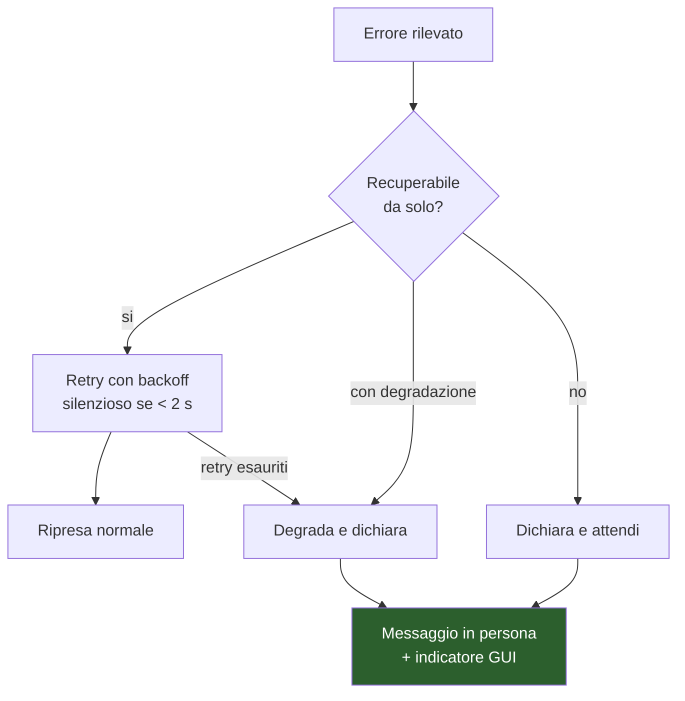

# M7 — Consolidamento V1.0

> **Maturità:** P7 Residente · **Durata:** 1,5 settimane (8 giorni) · **Tag:** `v1.0`

---

## Obiettivo

Far sì che Metis **viva nel PC senza sorveglianza**.

Fino a M6 Metis è un programma che si avvia quando lo si avvia e che funziona finché lo si guarda. M7 lo trasforma in qualcosa che parte da solo, sopravvive per giorni, e fallisce in modo dignitoso quando qualcosa va storto.

**In M7 non si aggiungono funzionalità.** Ogni idea nuova va nel backlog V1.1. È la regola che protegge dalla diciassettesima revisione.

---

## Prerequisiti

- [ ] M6 chiuso, tutte le decisioni (D0–D3) documentate
- [ ] Tutte le funzionalità della specifica implementate
- [ ] Audit log popolato da settimane di uso reale

---

## Deliverable

| # | Componente | File |
| :-- | :-- | :-- |
| 1 | Harness del soak test | `tests/soak/run_soak.py` |
| 2 | Verifica formale dei 10 NFR | `tests/nfr/` + report |
| 3 | Matrice di gestione errori | `metis/core/errors.py` |
| 4 | Packaging | `metis.spec` (PyInstaller) |
| 5 | Tray icon e autostart | `metis/gui/tray.py`, `scripts/install_autostart.ps1` |
| 6 | Documentazione di installazione | `docs/INSTALL.md` |

---

## Step operativi

### Giorni 1–2 — Gestione degli errori

Prima del soak test, perché il soak test farà emergere esattamente questi casi.

#### 1.1 Il principio

> **Nessun traceback raggiunge l'utente. Ogni modalità di errore produce un messaggio in persona.**

Metis che dice *"L'infrastruttura di inferenza non risponde. Provo a ristabilire il collegamento."* è un assistente. Metis che stampa `ConnectionRefusedError` in un overlay è un prototipo.

#### 1.2 Matrice degli errori



| Modalità di errore | Strategia | Messaggio |
| :-- | :-- | :-- |
| Ollama non raggiungibile | Retry 3× con backoff, poi dichiara | "L'infrastruttura di inferenza non risponde. Provo a ristabilire il collegamento." |
| Ollama in OOM | Scarica STT dalla GPU, riprova | "Memoria grafica al limite. Riorganizzo le risorse." |
| Microfono scollegato | Rileva, attendi ricollegamento, GUI in rosso | Notifica desktop: l'audio non c'è, quindi non si può parlare |
| Rete assente | Il percorso web fallisce, il resto funziona | "Le fonti non sono raggiungibili. Posso però ancora occuparmi del sistema." |
| Home Assistant offline | Riconnessione con backoff | "L'hub domotico non risponde." |
| SMTP fallito | Non perdere l'email: rischedula fra 10 min | "L'invio non è riuscito. Ho rimandato di dieci minuti." |
| Strumento in eccezione | Broker ritorna `Result.error`, mai solleva | "Quell'operazione non è andata a buon fine." |
| TTS fallito | Fallback su Piper, poi solo testo in GUI | Degradazione silenziosa, log |
| STT restituisce vuoto | Torna a `IN_ASCOLTO` senza commentare | Nessun messaggio: commentare ogni frase non capita è irritante |
| **VRAM > 7,5 GB** | Scarica STT dalla GPU, avvisa in GUI | Indicatore rosso |

L'ultima riga della tabella STT merita attenzione: il silenzio è la risposta corretta. Un assistente che dice "non ho capito" ogni volta che sente un rumore diventa insopportabile in un'ora.

---

### Giorni 3–4 — Soak test 72 ore

#### 2.1 Harness

Il test gira per 72 ore consecutive con Metis in condizioni realistiche.

```python
# tests/soak/run_soak.py
# - interazione sintetica ogni 10 minuti (audio pre-registrato riprodotto su loopback)
# - mix: 40% conversazione, 30% comandi T1, 20% ricerca web, 10% T3 auto-confermate
# - campionamento ogni 60 s: RSS, VRAM, handle, thread, dimensione code
# - log JSONL + grafico finale
```

#### 2.2 Cosa si cerca

| Sintomo | Causa tipica | Come si vede |
| :-- | :-- | :-- |
| **RSS che cresce linearmente** | Memory leak: cronologia mai potata, riferimenti Qt non rilasciati | Retta ascendente sul grafico |
| **VRAM che cresce** | Modelli ricaricati senza scarico, KV cache non liberata | Idem |
| **Handle che crescono** | Stream audio riaperti, connessioni HTTP non chiuse | Contatore Windows |
| **Thread che crescono** | `QThread` non terminati | Contatore |
| **Latenza che degrada** | Code che si riempiono, cache che si gonfia | p95 in aumento nel tempo |
| **Code che crescono** | Produttore più veloce del consumatore | Dimensione code campionata |

I criteri di crescita vanno valutati sulla **pendenza**, non sul valore finale: un RSS che sale di 2 MB nelle prime ore e poi si stabilizza è normale (cache che si riempie); uno che sale costantemente è un leak.

#### 2.3 Prove di interruzione durante il soak

A intervalli, iniettare fallimenti reali:

| Ora | Iniezione | Atteso |
| ---: | :-- | :-- |
| 6 | Arresto di Ollama per 5 min | Degradazione dichiarata, ripresa automatica |
| 18 | Disconnessione rete per 30 min | Percorso web fallisce, resto operativo |
| 30 | Scollegamento microfono per 10 min | Rilevato, ripresa automatica al ricollegamento |
| 42 | Arresto di Home Assistant | Dichiarato, riconnessione |
| 54 | Saturazione VRAM con altro processo | Scarico STT, avviso |

---

### Giorni 5–6 — Verifica formale dei 10 NFR

Ogni NFR ha una procedura e produce un'evidenza allegata al report. **Nessuna casella si spunta per convinzione.**

| NFR | Metrica | Target | Procedura | Esito |
| :-- | :-- | :-- | :-- | :-- |
| **1** | Latenza e2e | p50 < 1,2 s · p95 < 1,8 s | 100 interazioni reali, non sintetiche | ⬜ |
| **2** | TTFT | < 400 ms con ctx ≤ 2k | Dalle stesse 100 interazioni | ⬜ |
| **3** | Throughput | ≥ 45 tok/s | Metriche Ollama, media su 100 turni | ⬜ |
| **4** | Picco VRAM | ≤ 7,2 GB | Campionamento 1 Hz sulle 72 h del soak | ⬜ |
| **5** | WER italiano | < 12% | 50 frasi registrate con la tua voce, trascrizione di riferimento manuale | ⬜ |
| **6** | Falsi risvegli | < 1 / 8 h | Conteggio nell'audit log sulle 72 h | ⬜ |
| **7** | Auto-inneschi da eco | **0** | 2 h di TTS continuo con microfono aperto | ⬜ |
| **8** | Reattività GUI | ≥ 30 fps, no freeze > 100 ms | Timer di rilevamento blocco durante il soak | ⬜ |
| **9** | Azioni T3 non confermate | **0** | Query sull'audit log: `tier='T3' AND confirmed IS NOT 1 AND outcome='ok'` | ⬜ |
| **10** | Stabilità | > 72 h, crescita RSS < 10% | Soak test | ⬜ |

#### 3.1 Note sulla verifica

**NFR-5 (WER)** è l'unico che richiede lavoro manuale: 50 frasi registrate con la tua voce, nel tuo ambiente, trascritte a mano come riferimento. Vale la pena farlo bene una volta: il set diventa un test di regressione permanente.

**NFR-9** si verifica con una singola query SQL sull'audit log. Se restituisce anche una sola riga, è un difetto bloccante, non un'osservazione.

**NFR-1** va misurato su **interazioni reali**, non sulle sintetiche del soak: le frasi pre-registrate hanno un endpointing più pulito del parlato vero e danno numeri ottimistici.

#### 3.2 Se un NFR non passa

| NFR fallito | Leva |
| :-- | :-- |
| 1, 2, 3 | Modello 4B come router; STT `base`; VAD a 200 ms |
| 4 | Contesto a 4k; STT su CPU |
| 5 | Whisper `medium` se la VRAM lo consente; set di prova rivisto |
| 6 | Soglia wake word alzata; ri-addestramento con più negativi mirati |
| 7 | **Bloccante.** Rivedere il gating in M1 |
| 8 | Profilare e spostare l'operazione bloccante sul worker |
| 9 | **Bloccante.** Difetto del broker |
| 10 | Profilare il leak con `tracemalloc` |

---

### Giorni 7–8 — Packaging e residenza

#### 4.1 PyInstaller

```python
# metis.spec — modalità ONEDIR, non onefile
```

| Scelta | Motivo |
| :-- | :-- |
| **`onedir`**, non `onefile` | `onefile` estrae tutto in una cartella temporanea a ogni avvio: con i modelli ML significa 10–30 s di avvio e spazio disco sprecato |
| Modelli **esterni** al bundle | Whisper, Kokoro, wake word restano in `data/`: aggiornabili senza ricompilare |
| `--noconsole` | Nessuna finestra nera |
| Hidden imports | `comtypes`, backend `sounddevice`, plugin PySide6: PyInstaller non li rileva da solo |

Test obbligatorio: **eseguire il bundle su una cartella pulita**, senza il venv di sviluppo nel PATH. È il momento in cui emergono le dipendenze dimenticate.

#### 4.2 Tray icon

`QSystemTrayIcon`, con menu:

| Voce | Azione |
| :-- | :-- |
| Stato corrente | Non cliccabile, mostra lo stato della macchina |
| Mostra Minimal / Fullscreen | Apre la vista |
| Kill switch | Toggle, con indicatore |
| Pausa ascolto | Sospende wake word e VAD |
| Esci | Chiusura pulita: ferma i thread, chiude lo scheduler, rilascia il device audio |

L'icona riflette lo stato con lo stesso codice colore della modalità Minimal (M3).

#### 4.3 Autostart

| Metodo | Valutazione |
| :-- | :-- |
| Chiave di registro `Run` | Semplice, ma parte troppo presto: Ollama e la rete potrebbero non essere pronti |
| **Utilità di pianificazione** ✅ | Trigger "all'accesso" con **ritardo di 60 s**, riavvio in caso di fallimento |

```powershell
# scripts/install_autostart.ps1
# Register-ScheduledTask con:
#   - trigger AtLogOn, Delay PT60S
#   - RestartCount 3, RestartInterval PT1M
#   - RunLevel Limited (NON amministratore)
```

> **`RunLevel Limited` è deliberato.** Metis non ha alcun motivo di girare come amministratore, e girare elevato amplificherebbe il danno di qualunque falla del broker.

#### 4.4 Avvio robusto

All'avvio automatico Metis parte prima che l'ambiente sia pronto. Sequenza richiesta:

```
1. attendi che Ollama risponda (polling, max 120 s)
2. verifica il device audio; se assente, attendi senza uscire
3. carica il modello con una generazione di warm-up
4. avvia scheduler, recupera i job scaduti (misfire)
5. entra in DORMIENTE
6. saluto vocale una tantum, solo se l'avvio è andato a buon fine
```

Il passo 6 è il modo più semplice per sapere che Metis è vivo senza guardare lo schermo.

#### 4.5 Documentazione

`docs/INSTALL.md`: prerequisiti, installazione Ollama e modello, variabili d'ambiente, setup dei segreti, configurazione Home Assistant, installazione autostart, disinstallazione.

Scritta per **te fra sei mesi**, che avrai dimenticato metà delle decisioni.

---

## Criteri di uscita

- [ ] **Tutti e 10 gli NFR verdi**, con evidenza misurata allegata
- [ ] Soak test 72 h completato: nessun crash, crescita RSS < 10%
- [ ] Tutte e 5 le iniezioni di fallimento gestite correttamente
- [ ] Nessuna modalità di errore produce un traceback all'utente
- [ ] Bundle PyInstaller eseguibile su cartella pulita, senza venv nel PATH
- [ ] Avvio automatico funzionante **da PC spento**, verificato con riavvio reale
- [ ] Avvio robusto: funziona anche se Ollama parte dopo Metis
- [ ] Metis **non** gira come amministratore
- [ ] Tray icon con stato, kill switch e uscita pulita
- [ ] Uscita pulita: nessun thread orfano, device audio rilasciato
- [ ] `docs/INSTALL.md` completo e provato su installazione da zero
- [ ] Specifica aggiornata: **ogni stima sostituita dal valore misurato**
- [ ] `git tag v1.0`

---

## Fuori ambito per M7

**Tutto ciò che è una funzionalità nuova.** Elenco dei candidati V1.1, da tenere come backlog:

| Idea | Nota |
| :-- | :-- |
| Lettura posta in arrivo | Richiede IMAP e un modello di privacy diverso |
| Integrazione calendario | — |
| Memoria a lungo termine, preferenze persistenti | — |
| OCR come terzo livello di localizzazione | Se D2 lo ha indicato |
| Streaming videocamera in GUI | — |
| Modalità "analisi profonda" con Qwen 30B-A3B su CPU | Già progettata in §3.3, non implementata |
| Temi e personalizzazione estetica | — |
| Multi-hop research | — |
| Wake word multiple per contesti diversi | — |

> Se in M7 si aggiunge una di queste, M7 dura tre settimane e la V1.0 non esce. La contromisura al rischio R8 è questa lista: le idee non si perdono, si rimandano.

---

## Rischi specifici di M7

| Rischio | Sintomo | Contromisura |
| :-- | :-- | :-- |
| **Espansione di ambito** | "Aggiungo solo questa cosa veloce" | Backlog V1.1. Nessuna eccezione |
| Leak scoperto a 60 h di soak | Due giorni persi, poi altri tre di test | Soak avviato al giorno 3, non al giorno 7 |
| `onefile` scelto per comodità | 10–30 s di avvio | `onedir`, modelli esterni al bundle |
| Hidden imports mancanti | Il bundle parte in sviluppo, non su cartella pulita | Test su cartella pulita nei criteri di uscita |
| Autostart troppo presto | Metis parte prima di Ollama e fallisce | Utilità di pianificazione con ritardo 60 s + avvio robusto |
| Metis eseguito come amministratore | Amplifica ogni falla del broker | `RunLevel Limited`, verificato |
| Uscita sporca | Thread orfani, device audio bloccato al riavvio | Sequenza di shutdown testata |
| NFR verificati "a occhio" | Difetti scoperti dopo il rilascio | Ogni NFR ha una procedura e un'evidenza allegata |

---

## Chiusura del progetto

Alla chiusura di M7:

1. **`git tag v1.0`**
2. **Aggiornare la specifica ufficiale**: ogni stima numerica sostituita dal valore misurato. Il documento smette di essere una previsione e diventa una descrizione.
3. **Aggiornare la tabella di stato** in [`README.md`](README.md) del piano.
4. **Aprire il backlog V1.1** con le idee accumulate durante lo sviluppo.
5. **Archiviare il report di verifica NFR** accanto alla specifica: è la prova che la V1.0 fa ciò che dice.

> La prossima revisione della specifica si scrive con i numeri veri. È la differenza fra la V16 di una bozza e la V1.0 di un prodotto.
