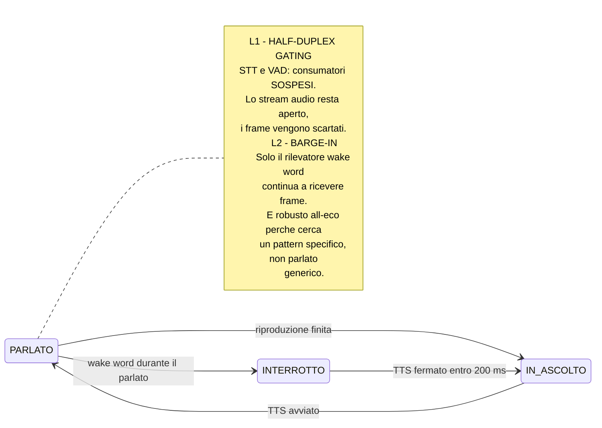

# M1 — Fondamenta Vocali

> ## ⏸️ Esito: wake word rimandata alla v2 — D1, 2026-09-21
>
> Questo piano è stato eseguito per intero, ma **la wake word non entra in
> V1.0**: 57 auto-inneschi in 125 minuti di prova NFR-7, contro un requisito
> di zero. L'attivazione della V1.0 è il **push-to-talk**, che la specifica
> prevedeva già come permanente.
>
> Il modello (v3, riaddestrato con negativi duri reali), i banchi di prova e
> i dati restano in repository. Si riaccende con `enabled = true` in
> `config/wakeword.toml`.
>
> Tutto ciò che questo piano descrive su macchina a stati, gating
> half-duplex, `WAKE_ACTIVE` e barge-in **resta valido e in produzione**: è
> quello che rende la riaccensione una riga di configurazione. Il barge-in in
> V1.0 passa dal push-to-talk e percorre lo stesso codice.
>
> Decisione completa: [§21 della specifica](../Metis_V1.0_Specifica_Ufficiale.md) ·
> misure: [TRACKING/M1_tracking.md](../../TRACKING/M1_tracking.md)


> **Maturità:** P1 Attento · **Durata:** 1,5 settimane (8 giorni) · **Tag:** `m1-voice`

---

## Obiettivo

Rendere il sistema capace di **stare acceso senza impazzire**.

In M0 Metis parla solo quando premi un tasto. Da M1 vive in background, si sveglia alla voce e — soprattutto — **non si ascolta parlare**. È l'iterazione che trasforma un demo in qualcosa che può restare in esecuzione.

---

## Prerequisiti

- [ ] M0 chiuso, decision gate D0 completato
- [ ] Modello LLM e motore TTS definitivi scelti
- [ ] Catena vocale funzionante da push-to-talk
- [ ] Piper installato (serve per generare i dati sintetici della wake word)

---

## Deliverable

| # | Componente | File |
| :-- | :-- | :-- |
| 1 | Modello wake word "Hey Metis" addestrato | `data/wakeword/hey_metis.onnx` |
| 2 | Macchina a stati completa di §5 | `metis/core/state_machine.py` |
| 3 | Half-duplex gating (L1) | `metis/core/orchestrator.py` |
| 4 | Barge-in via wake word (L2) | idem |
| 5 | Logging strutturato | `metis/core/logging.py` |
| 6 | Audit log SQLite | `metis/security/audit.py` |

---

## Step operativi

### Giorni 1–4 — Wake word "Hey Metis"

Il percorso più lungo di M1, e quello con più incertezza. Va avviato per primo perché l'addestramento richiede tempo macchina non comprimibile.

#### 1.1 Perché "Hey Metis" è una buona frase

| Proprietà | Valore |
| :-- | :-- |
| Sillabe | 4 — sopra la soglia di 3 sotto cui i falsi positivi esplodono |
| Fonemi distintivi | `/ɛi/` + `/m/` + `/ɛ/` + `/t/` — buona separazione acustica |
| Collisioni in italiano | Nessuna parola comune la contiene |
| Pronunciabilità | L'anglismo "hey" è naturale anche in una frase italiana |

#### 1.2 Generazione dei dati di training

openWakeWord si addestra su **dati sintetici**: non serve registrare migliaia di campioni a voce.

| Insieme | Quantità indicativa | Come si genera |
| :-- | ---: | :-- |
| **Positivi** | 3.000 – 5.000 | Piper, variando voce italiana e inglese, velocità (0.85–1.15×), pitch |
| **Positivi difficili** | 500 | "Hey Metis" pronunciato dentro frasi più lunghe, con rumore di fondo |
| **Negativi** | 10.000+ | Dataset di rumore/parlato fornito dal progetto openWakeWord |
| **Negativi mirati** | 500 | Frasi foneticamente vicine: "ehi", "metti", "hey", "mettiamo", "Mattia", "amnesie" |

> I **negativi mirati** sono il passaggio che la maggior parte delle guide salta ed è quello che determina il tasso di falsi risvegli. "Metti" e "mettiamo" sono parole comunissime in italiano: se non le metti nei negativi, Metis si sveglierà ogni volta che dici "metti via".

#### 1.3 Augmentation obbligatoria

Il modello deve funzionare **nella tua stanza**, non in uno studio:

- rumore di fondo a SNR variabile (ventole del PC, tastiera, TV)
- riverbero (RIR sintetiche)
- **registrazione dell'audio del tuo microfono reale** su alcune centinaia di campioni: la risposta in frequenza del microfono conta

#### 1.4 Addestramento ed export

```bash
# notebook/script di training openWakeWord
# output atteso: data/wakeword/hey_metis.onnx
```

#### 1.5 `metis/audio/wakeword.py`

```python
from openwakeword.model import Model

class WakeWordDetector:
    def __init__(self, path: str, threshold: float = 0.6):
        self.model = Model(wakeword_models=[path])
        self.threshold = threshold

    def feed(self, frame: np.ndarray) -> bool:
        """frame: 1280 campioni int16 a 16 kHz (80 ms)."""
        scores = self.model.predict(frame)
        return max(scores.values()) >= self.threshold
```

Gira su **CPU**, sempre attivo, consumo trascurabile.

#### 1.6 Taratura della soglia

| Soglia | Effetto |
| :-- | :-- |
| 0.4 | Molti falsi risvegli, pochi mancati |
| **0.6** | Punto di partenza |
| 0.8 | Pochi falsi risvegli, molti mancati |

La soglia va esposta in configurazione e, da M3, regolabile da GUI. Non è un valore da fissare una volta: dipende dal microfono, dalla stanza e da come parli.

---

### Giorni 5–6 — Macchina a stati

È il componente centrale del sistema. Wake word, anti-eco e barge-in non sono tre funzionalità: sono tre conseguenze di questa.

#### 2.1 Gli stati

```python
from enum import Enum, auto

class State(Enum):
    DORMIENTE = auto()        # solo wake word attivo
    IN_ASCOLTO = auto()       # VAD attivo, attende parlato
    TRASCRIZIONE = auto()     # parlato in corso, accumula audio
    ELABORAZIONE = auto()     # routing intento
    RICERCA_WEB = auto()      # M5
    GENERAZIONE = auto()      # LLM in streaming
    ESECUZIONE = auto()       # M2
    ATTESA_CONFERMA = auto()  # M2
    PARLATO = auto()          # TTS in riproduzione — STT SOSPESO
    INTERROTTO = auto()       # barge-in rilevato
    ERRORE = auto()
```

In M1 si implementano tutti gli stati, anche quelli i cui consumatori arrivano dopo. Gli stati `RICERCA_WEB`, `ESECUZIONE` e `ATTESA_CONFERMA` esistono come transizioni valide ma senza contenuto: aggiungerli dopo significa riscrivere la macchina.

#### 2.2 Tabella delle transizioni

Definirla come **dato**, non come catena di `if`. Rende la macchina testabile senza audio.

```python
TRANSITIONS: dict[tuple[State, Event], State] = {
    (State.DORMIENTE,   Event.WAKE_WORD):      State.IN_ASCOLTO,
    (State.DORMIENTE,   Event.PTT):            State.IN_ASCOLTO,
    (State.IN_ASCOLTO,  Event.SPEECH_START):   State.TRASCRIZIONE,
    (State.IN_ASCOLTO,  Event.TIMEOUT):        State.DORMIENTE,
    (State.TRASCRIZIONE,Event.SPEECH_END):     State.ELABORAZIONE,
    (State.TRASCRIZIONE,Event.NO_SPEECH):      State.IN_ASCOLTO,
    (State.ELABORAZIONE,Event.INTENT_KNOWN):   State.ESECUZIONE,
    (State.ELABORAZIONE,Event.INTENT_CHAT):    State.GENERAZIONE,
    (State.GENERAZIONE, Event.FIRST_AUDIO):    State.PARLATO,
    (State.PARLATO,     Event.WAKE_WORD):      State.INTERROTTO,   # barge-in
    (State.PARLATO,     Event.PLAYBACK_DONE):  State.IN_ASCOLTO,
    (State.INTERROTTO,  Event.TTS_STOPPED):    State.IN_ASCOLTO,
    # ... errori da ogni stato
}
```

**Transizione non prevista = errore loggato, non eccezione.** La macchina deve sopravvivere a eventi fuori sequenza: arrivano di continuo, perché l'audio è asincrono.

#### 2.3 Timeout per stato

| Stato | Timeout | Destinazione |
| :-- | ---: | :-- |
| `IN_ASCOLTO` | 8 s | `DORMIENTE` |
| `TRASCRIZIONE` | 30 s | `ELABORAZIONE` (tronca) |
| `ELABORAZIONE` | 5 s | `ERRORE` |
| `GENERAZIONE` | 30 s | `ERRORE` |
| `ATTESA_CONFERMA` | 20 s | rifiuto implicito |

---

### Giorno 7 — Anti-eco e barge-in

Il cuore dell'iterazione. Due livelli, entrambi a costo zero.



#### 3.1 L1 — Half-duplex gating

```python
def on_audio_frame(self, frame):
    # Il wake word riceve SEMPRE
    if self.wakeword.feed(frame):
        self.emit(Event.WAKE_WORD)

    # VAD e STT ricevono solo fuori dallo stato PARLATO
    if self.state is State.PARLATO:
        return              # ← qui si rompe il loop di auto-innesco
    self.vad.feed(frame)
```

> **Dettaglio importante:** non chiudere e riaprire lo stream audio. Riaprire un device costa 50–200 ms e a volte fallisce. Si lascia lo stream aperto e si scartano i frame.

#### 3.2 L2 — Barge-in

```python
def on_wake_word(self):
    if self.state is State.PARLATO:
        self.tts.stop()             # sd.stop() — immediato
        self.tts_queue.clear()      # scarta le frasi non ancora sintetizzate
        self.llm.cancel()           # interrompe lo stream di generazione
        self.transition(State.INTERROTTO)
```

Tre cose vanno fermate, non una. Dimenticare `tts_queue.clear()` produce il bug più fastidioso di tutta questa fase: Metis si interrompe, poi riprende a parlare da solo dopo un secondo, perché la frase successiva era già in coda.

#### 3.3 Latenza di interruzione

Target: **< 200 ms** dal rilevamento della wake word al silenzio. Misurabile con un microfono che registra l'uscita.

---

### Giorno 8 — Osservabilità

#### 4.1 Logging strutturato — `metis/core/logging.py`

`structlog` con doppio sink: console leggibile durante lo sviluppo, JSONL su file per l'analisi.

Campi obbligatori su ogni evento:

| Campo | Esempio |
| :-- | :-- |
| `ts` | timestamp ISO con millisecondi |
| `state` | `PARLATO` |
| `event` | `wake_word_detected` |
| `turn_id` | UUID del turno conversazionale |
| `latency_ms` | quando applicabile |

**Ogni transizione di stato produce una riga.** È ciò che permette di diagnosticare l'interazione vocale, che altrimenti è una scatola nera.

#### 4.2 Audit log — `metis/security/audit.py`

Va creato ora, anche se in M1 non ci sono ancora strumenti da tracciare. Averlo pronto significa che M2 non deve inventarselo di corsa.

```sql
CREATE TABLE audit (
    id          INTEGER PRIMARY KEY AUTOINCREMENT,
    ts          TEXT    NOT NULL,
    turn_id     TEXT,
    tool        TEXT    NOT NULL,
    tier        TEXT    NOT NULL,   -- T0 | T1 | T2 | T3
    args_json   TEXT    NOT NULL,
    confirmed   INTEGER,            -- NULL se non richiesta
    outcome     TEXT    NOT NULL,   -- ok | denied | error
    detail      TEXT
);
```

**Append-only:** nessun `UPDATE`, nessun `DELETE` nel codice applicativo.

---

## Criteri di uscita

### Test obbligatori

| Test | Procedura | Soglia |
| :-- | :-- | :-- |
| **NFR-7 — auto-inneschi** | Far parlare Metis in loop per **2 ore** con microfono aperto e altoparlanti accesi al volume d'uso | **0 auto-inneschi** |
| **NFR-6 — falsi risvegli** | **8 ore** di uso normale del PC con Metis attivo: lavoro, musica, video, telefonate | **< 1 falso risveglio** |
| **Mancati riconoscimenti** | 50 pronunce di "Hey Metis" in condizioni normali | **< 10% mancati** |
| **Latenza barge-in** | 20 interruzioni misurate | **< 200 ms** |

### Checklist

- [ ] NFR-7: zero auto-inneschi in 2 h di TTS continuo
- [ ] NFR-6: < 1 falso risveglio in 8 h di uso normale
- [ ] Mancato riconoscimento wake word < 10% su 50 tentativi
- [ ] Barge-in: "Hey Metis" interrompe entro 200 ms, e Metis **non riprende da solo**
- [ ] Push-to-talk funziona in parallelo alla wake word
- [ ] Ogni transizione di stato è tracciata nel log JSONL
- [ ] La macchina a stati sopravvive a 100 eventi casuali fuori sequenza senza eccezioni
- [ ] Schema audit log creato e scrivibile
- [ ] `git tag m1-voice`

### Decision gate D1

| Decisione | Criterio | Alternativa |
| :-- | :-- | :-- |
| Wake word promossa | Mancati < 10% **e** falsi risvegli < 1/8h | **Porcupine** con keyword custom. Il push-to-talk copre comunque il caso nel frattempo |

---

## Fuori ambito per M1

| Non si fa | Arriva in |
| :-- | :-- |
| AEC vero (L3) | M6, e solo se si usano gli altoparlanti |
| Qualunque strumento o azione | M2 |
| GUI | M3 |
| Memoria conversazionale strutturata | M5 |
| Persona e system prompt definitivo | M5 |

---

## Rischi specifici di M1

| Rischio | Sintomo | Contromisura |
| :-- | :-- | :-- |
| **Falsi risvegli su "metti"/"mettiamo"** | Metis si attiva durante conversazioni normali | Negativi mirati nel training (§1.2). È il rischio numero uno in italiano |
| Wake word addestrata su voci sintetiche non generalizza | Funziona nei test, non con la tua voce | Includere registrazioni reali del tuo microfono nell'augmentation |
| Metis riprende a parlare dopo il barge-in | Interruzione apparente, poi riparte | Svuotare **tutte e tre** le code: TTS, coda frasi, stream LLM |
| Stream audio riaperto a ogni transizione | Latenza extra, fallimenti sporadici del device | Stream sempre aperto, si scartano i frame |
| Macchina a stati con `if` annidati | Bug non riproducibili, impossibile testare | Tabella di transizioni come dato, testabile senza audio |
| Eventi fuori sequenza causano eccezioni | Crash dopo minuti di uso | Transizione non prevista → log, non eccezione |

---

## Handoff a M2

M1 consegna:

1. **Un assistente che può restare acceso.** Da qui in poi lo sviluppo si fa con Metis in esecuzione.
2. **La macchina a stati**, su cui M2 innesta `ESECUZIONE` e `ATTESA_CONFERMA`.
3. **L'audit log**, pronto a ricevere le prime scritture reali.
4. **Il logging strutturato**, che da M2 diventa lo strumento principale di debug.
