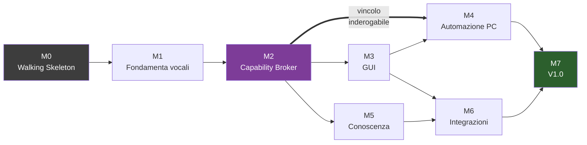

# Piano di Esecuzione Metis — Indice delle Iterazioni

Documenti operativi per le otto iterazioni che portano dal prototipo alla V1.0.
Riferimento normativo: [`../Metis_V1.0_Specifica_Ufficiale.md`](../Metis_V1.0_Specifica_Ufficiale.md)

---

## Come si usano questi documenti

Ogni file è un **documento di lavoro**, non di lettura: lo si tiene aperto mentre si scrive codice. Struttura identica per tutti:

| Sezione | A cosa serve |
| :-- | :-- |
| **Obiettivo** | La domanda a cui l'iterazione risponde |
| **Prerequisiti** | Cosa deve essere già vero prima di iniziare |
| **Step operativi** | I passaggi concreti, con comandi, file e codice |
| **Criteri di uscita** | Checklist verificabile — nessuna casella si spunta senza evidenza |
| **Fuori ambito** | Cosa NON si fa qui, per evitare l'espansione di ambito |
| **Rischi e contromisure** | Cosa può andare storto in questa fase specifica |
| **Handoff** | Cosa consegna alla iterazione successiva |

**Regola trasversale:** ogni iterazione chiude con un tag git e con i numeri misurati sostituiti alle stime.

---

## Le otto iterazioni

| # | Documento | Maturità | Durata | Obiettivo in una riga |
| :-- | :-- | :-- | :-- | :-- |
| **M0** | [M0_Walking_Skeleton.md](M0_Walking_Skeleton.md) | P0 Pappagallo | 1 sett | Sta in 8 GB? Risponde in meno di 2 s? |
| **M1** | [M1_Fondamenta_Vocali.md](M1_Fondamenta_Vocali.md) | P1 Attento | 1,5 sett | Stare acceso senza impazzire |
| **M2** | [M2_Capability_Broker.md](M2_Capability_Broker.md) | P2 Obbediente | 1,5 sett | Agire solo dove è autorizzato |
| **M3** | [M3_Interfaccia_Grafica.md](M3_Interfaccia_Grafica.md) | P3 Visibile | 2 sett | Avere una faccia che non si blocca |
| **M4** | [M4_Automazione_PC.md](M4_Automazione_PC.md) | P4 Operativo | 1,5 sett | Controllare davvero il computer |
| **M5** | [M5_Conoscenza.md](M5_Conoscenza.md) | P5 Informato | 1,5 sett | Sapere cose che non ha nei pesi |
| **M6** | [M6_Integrazioni.md](M6_Integrazioni.md) | P6 Connesso | 1,5 sett | Agire nel tempo e nel mondo fisico |
| **M7** | [M7_Consolidamento_V1.md](M7_Consolidamento_V1.md) | P7 Residente | 1,5 sett | Vivere nel PC senza sorveglianza |

---

## Dipendenze fra iterazioni

**L'unico vincolo d'ordine non negoziabile è M2 prima di M4.** Il Capability Broker deve esistere ed essere testato prima che esista qualunque strumento capace di iniettare input nell'OS. Costruire prima l'automazione e aggiungere la sicurezza dopo significa non aggiungerla mai davvero.

M3 (GUI) e M5 (conoscenza) sono parallelizzabili: dipendono da componenti diversi e non si toccano.

---

## Decision gate

| Gate | Quando | Cosa si decide | Documento |
| :-- | :-- | :-- | :-- |
| **D0** | Fine M0 | Modello LLM definitivo, motore TTS definitivo, validità del budget di latenza | [M0](M0_Walking_Skeleton.md#7-decision-gate-d0) |
| **D1** | Fine M1 | Wake word promossa o sostituita da Porcupine | [M1](M1_Fondamenta_Vocali.md#criteri-di-uscita) |
| **D2** | Fine M4 | Strategia di localizzazione elementi: UIA sufficiente o serve OCR | [M4](M4_Automazione_PC.md#criteri-di-uscita) |
| **D3** | Inizio M6 | AEC necessario (altoparlanti) o superfluo (cuffie) | [M6](M6_Integrazioni.md#step-7--aec-opzionale) |

---

## Stato di avanzamento

| Iterazione | Stato | Tag git | Note |
| :-- | :-- | :-- | :-- |
| M0 | ⬜ Da iniziare | `m0-skeleton` | — |
| M1 | ⬜ Da iniziare | `m1-voice` | — |
| M2 | ⬜ Da iniziare | `m2-broker` | — |
| M3 | ⬜ Da iniziare | `m3-gui` | — |
| M4 | ⬜ Da iniziare | `m4-automation` | — |
| M5 | ⬜ Da iniziare | `m5-knowledge` | — |
| M6 | ⬜ Da iniziare | `m6-integrations` | — |
| M7 | ⬜ Da iniziare | `v1.0` | — |

*Aggiornare questa tabella alla chiusura di ogni iterazione.*
