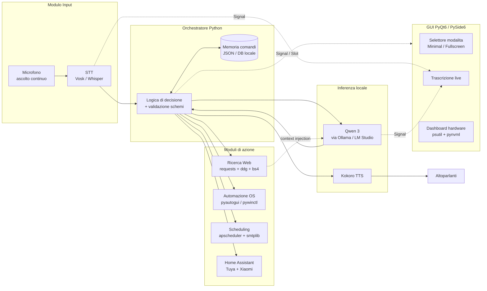
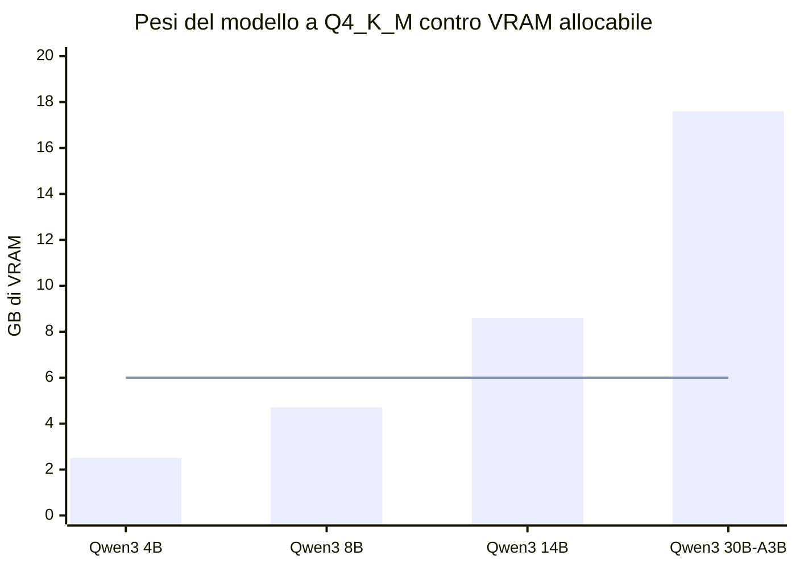
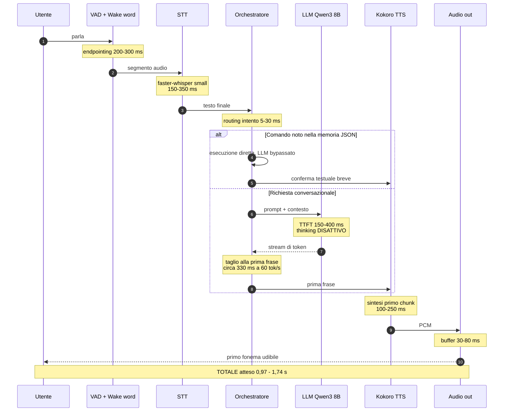
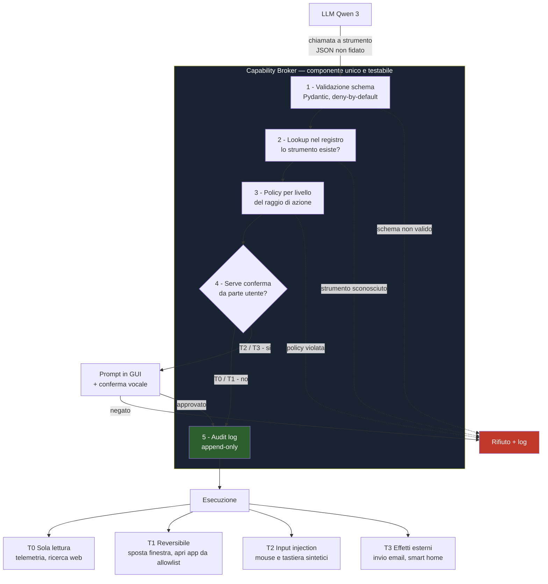
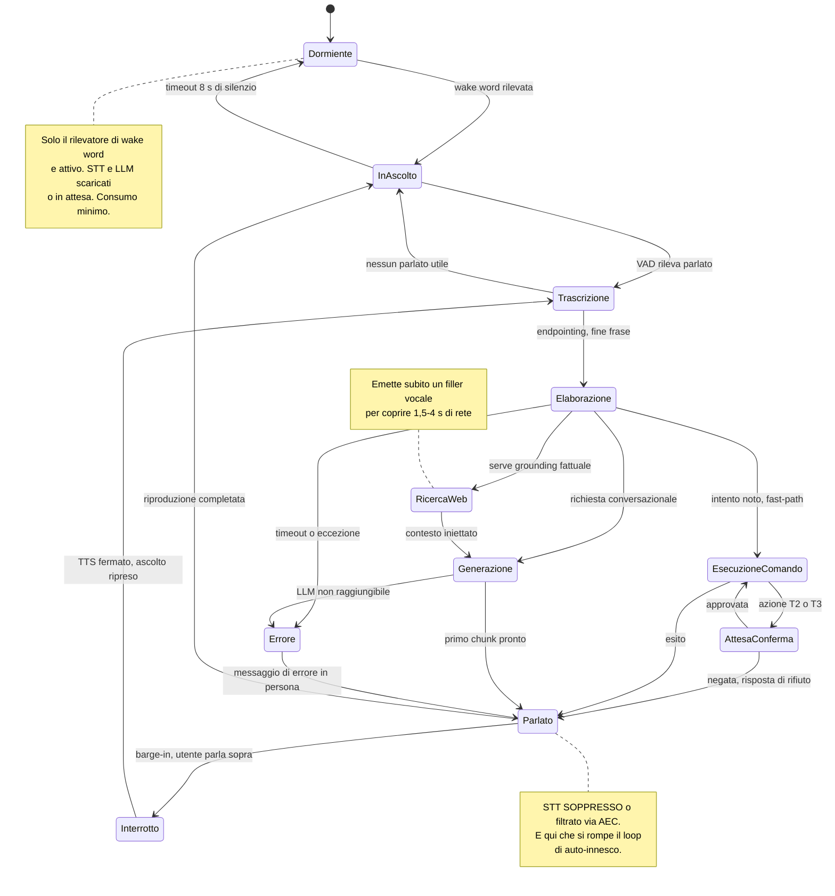
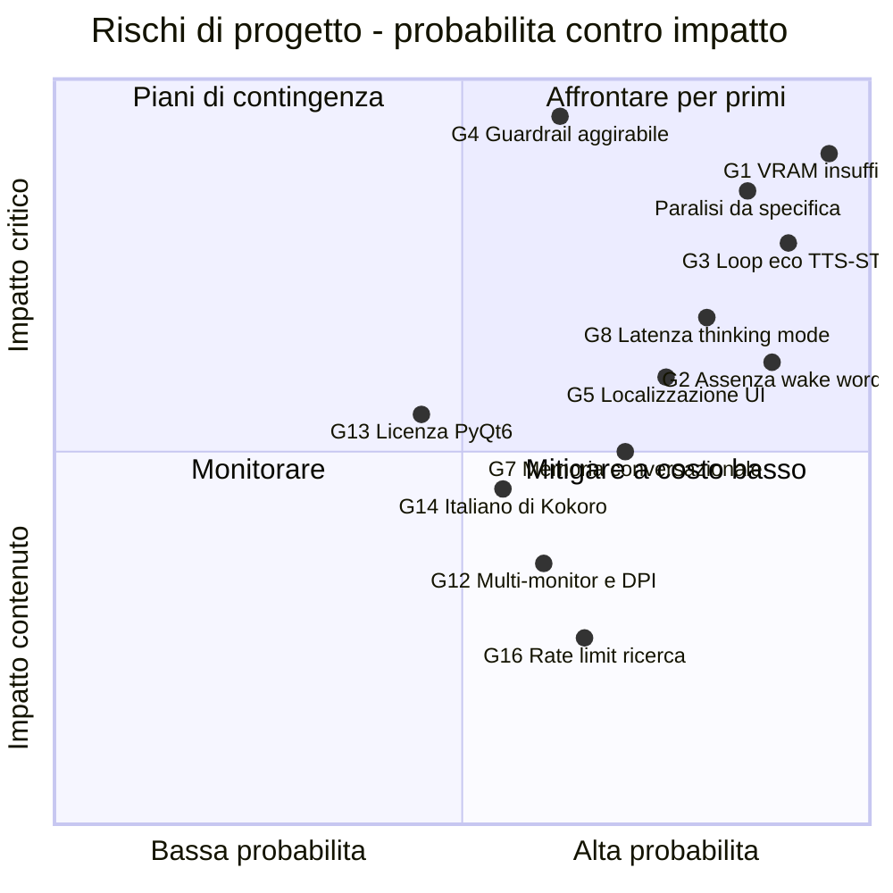
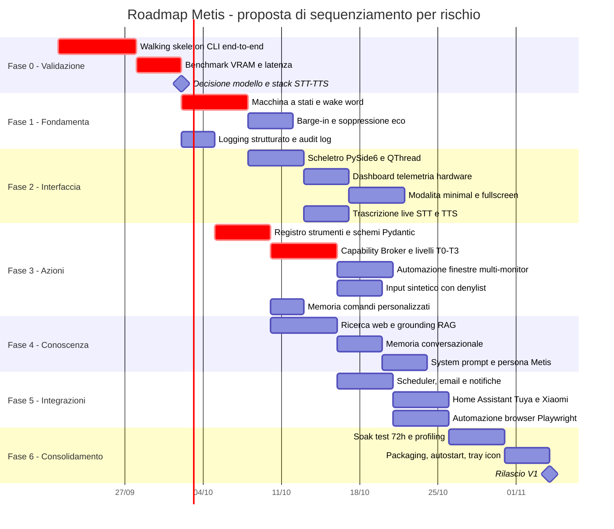

# Report di Analisi — Bozza Progetto "Metis" V16

> **Documento analizzato:** `SPECS/bozza Metis V16.md`
> **Data analisi:** 2026-09-20
> **Stato repository:** sola documentazione — nessun codice implementato (`README.md`, `SPECS/`, cartella `Claude/` vuota)
> **Natura:** revisione architetturale, analisi di fattibilità e piano di rientro

---

## 1. Sintesi Esecutiva

La bozza V16 è **un documento di visione maturo e internamente coerente sul piano funzionale**, ma presenta **quattro difetti bloccanti sul piano ingegneristico**. Non emergono dalla lettura perché riguardano vincoli fisici e di sicurezza che il testo non modella.

| # | Area | Verdetto |
| :-- | :-- | :-- |
| ✅ | **Scelta dello stack** | Corretta e idiomatica. Python + Qt + Ollama + Kokoro è la combinazione giusta per il caso d'uso. |
| ✅ | **Architettura a moduli e Segnali/Slot** | Corretta. Il disaccoppiamento GUI/orchestratore via `Signal` è la soluzione canonica al freezing dell'UI. |
| 🔴 | **Budget VRAM** | **Bloccante.** La RTX 2070 Super ha **8 GB**. Qwen 3 14B Q4 richiede ~8,6 GB di soli pesi, la 30B ~17,6 GB. Il modello principale indicato in §8 **non entra in memoria**, e a esso vanno sommati STT e TTS. |
| 🔴 | **Pipeline vocale** | **Bloccante.** Mancano *wake word*, *cancellazione d'eco* e *barge-in*. Con "ascolto continuo" + TTS sugli altoparlanti il sistema **si ascolta parlare e si auto-innesca in loop**. |
| 🔴 | **Guardrail file system (§5.3)** | **Non applicabile come scritto.** Bloccare `os`/`shutil` non protegge nulla: i due vettori reali sono `subprocess` (§6) e la **sintesi di tastiera** (§9), entrambi esplicitamente autorizzati. |
| 🟠 | **Latenza** | Il requisito "bassa latenza" non ha un numero. Senza disciplinare la *thinking mode* di Qwen 3, la latenza percepita passa da ~1,2 s a 5–20 s. |
| 🟠 | **Localizzazione elementi UI** | "Clicca sul link \[nome\]" è specificato via coordinate `pyautogui`, ma **nulla nella bozza produce quelle coordinate**. Manca il livello UIA/OCR/vision. |
| 🟠 | **Processo** | Siamo alla **revisione 16 di una bozza con zero righe di codice**. Il rischio dominante non è tecnico: è la paralisi da specifica. |

**Raccomandazione centrale:** congelare la V16 come documento di visione e **aprire subito un *walking skeleton*** — microfono → risposta vocale, da riga di comando, senza GUI — per misurare la latenza reale e validare il budget VRAM *prima* di scrivere l'interfaccia. Le decisioni ancora aperte (14B vs 8B, Vosk vs Whisper, Kokoro vs Piper) sono decidibili solo con numeri misurati, non con un'altra revisione del documento.

---

## 2. Architettura Come Specificata

Ricostruzione fedele di quanto descritto nelle §4, §6, §7 e §9.



**Osservazione strutturale.** Il grafo è corretto ma **incompleto in tre punti**, e ogni lacuna corrisponde a un arco o a un nodo che il documento non nomina:

1. Non esiste alcun arco da `SPK` verso `MIC`: il documento non modella il fatto che l'audio prodotto **rientra fisicamente** nel microfono.
2. Non esiste alcun nodo tra `MIC` e `STT` che decida *quando* ascoltare (wake word / VAD).
3. Non esiste alcun nodo tra `ORCH` e `TOOLS` che decida *se un'azione è permessa*. Il guardrail §5.3 è descritto come una proprietà diffusa del codice, non come un componente. Ciò che non è un componente non è testabile, e ciò che non è testabile non è un controllo di sicurezza.

---

## 3. Fattibilità Hardware — il vincolo dominante

### 3.1 Il problema

La §2 indica la RTX 2070 Super come acceleratore; la §8 indica **Qwen 3 14B / 30B** come modello principale. Le due affermazioni sono incompatibili: la 2070 Super ha **8 GB di VRAM**, non espandibili.



*La linea orizzontale a 6 GB rappresenta la VRAM realisticamente allocabile all'LLM dopo desktop Windows, STT e TTS. I valori sono stime di ordine di grandezza, da validare con benchmark reale.*

### 3.2 Budget VRAM dettagliato

Configurazione di riferimento: Qwen 3 8B Q4_K_M, contesto 8k.

| Consumatore | Configurazione | VRAM stimata |
| :-- | :-- | ---: |
| Desktop Windows + compositing + browser | baseline realistica | 0,8 – 1,5 GB |
| Pesi LLM | Qwen 3 8B `Q4_K_M` | ~4,7 GB |
| KV cache | 8k ctx, non quantizzata | 0,5 – 0,9 GB |
| STT | `faster-whisper small`, `int8_float16` | ~0,6 GB |
| TTS | Kokoro 82M, fp32 | ~0,4 GB |
| **Totale** | | **7,0 – 8,1 GB** |

**Verdetto:** anche con l'8B si è **al limite superiore degli 8 GB**. Il rischio non è solo l'OOM: su Windows con WDDM l'eccedenza *rifluisce silenziosamente in RAM di sistema* invece di fallire, degradando le prestazioni di un fattore 5–10 senza alcun errore visibile. È una classe di bug particolarmente insidiosa da diagnosticare a posteriori.

### 3.3 Mitigazioni, in ordine di efficacia

| # | Mitigazione | Effetto | Costo |
| :-- | :-- | :-- | :-- |
| M1 | **Kokoro su CPU** | libera ~0,4 GB | trascurabile: 82M parametri, ampiamente in tempo reale su un 5800X |
| M2 | **KV cache quantizzata a q8_0** | libera 0,3 – 0,5 GB | perdita di qualità non percepibile in uso conversazionale |
| M3 | **`keep_alive` esplicito su Ollama** | evita scarico/ricarico e doppie allocazioni | nessuno, è configurazione |
| M4 | **Contesto a 4k invece di 8k** | libera ~0,4 GB | richiede gestione attiva della memoria conversazionale |
| M5 | **STT su CPU** (`distil-whisper` o Vosk) | libera ~0,6 GB | +100–250 ms di latenza STT |
| M6 | **Qwen 3 4B come router** | libera ~2,2 GB | qualità inferiore in italiano; valido solo come classificatore d'intento |

Applicando **M1 + M2 + M3** il budget scende a ~6,1 – 7,0 GB: l'8B diventa una configurazione **solida**, non acrobatica. M4–M6 restano in riserva.

### 3.4 Velocità di generazione attesa

La 2070 Super ha ~448 GB/s di banda di memoria. Per modelli *memory-bound* la generazione è approssimabile con `banda / dimensione_pesi`, con efficienza reale del 55–70%.

| Modello | Dove gira | tok/s teorici | tok/s realistici | Giudizio |
| :-- | :-- | ---: | ---: | :-- |
| Qwen 3 4B Q4 | GPU interamente | ~179 | 100 – 120 | ottimo, ma sovradimensionato rispetto al bisogno |
| **Qwen 3 8B Q4** | **GPU interamente** | **~95** | **55 – 70** | ✅ **raccomandato come primario** |
| Qwen 3 14B Q4 | GPU + offload CPU parziale | — | 6 – 12 | ❌ inutilizzabile nel percorso vocale |
| Qwen 3 30B-A3B Q4 | RAM di sistema, 3B attivi | ~24 | 10 – 16 | 🟡 valido solo per task non interattivi |

**Nota sul 30B-A3B.** Essendo MoE con soli 3B parametri attivi, gira su CPU/RAM (32 GB disponibili) a velocità sorprendentemente decenti. Non serve al percorso vocale interattivo, ma è un candidato valido come **"modalità analisi profonda" opzionale**, dove 30–60 s di attesa sono accettabili perché l'utente li ha richiesti esplicitamente.

**Conclusione §3 — la §8 va riscritta.** Qwen 3 8B primario, 4B come router opzionale, 30B-A3B come modalità lenta su CPU. La **14B va eliminata**: è la peggiore delle tre opzioni, perché non entra in GPU e non gode della sparsità della MoE.

---

## 4. Pipeline Vocale — le tre lacune bloccanti

### 4.1 Il ciclo di feedback non modellato

Il requisito §7 ("utilizzo continuo del microfono") combinato con §10 (risposta vocale) crea, in assenza di contromisure, un **loop di auto-innesco**: Kokoro parla → il microfono cattura → lo STT trascrive → l'orchestratore interpreta la voce di Metis come comando dell'utente.

Nessuno dei tre meccanismi standard che rompono questo loop compare nella bozza:

| Meccanismo mancante | Funzione | Tecnologia suggerita |
| :-- | :-- | :-- |
| **Wake word** | attiva l'ascolto solo su "Metis" | `openWakeWord` (Apache 2.0, addestrabile su parola custom) o Porcupine |
| **AEC** — Acoustic Echo Cancellation | sottrae dal microfono ciò che esce dagli altoparlanti | `webrtc-audio-processing` / `speexdsp`; in alternativa **le cuffie**, che risolvono il problema per costruzione |
| **Barge-in / half-duplex** | permette di interrompere Metis parlando, e sopprime lo STT mentre il TTS è attivo | gestione a stati nell'orchestratore, vedi §7 |

**Scorciatoia pragmatica:** se l'uso previsto è con cuffie, l'AEC diventa superfluo e restano wake word + gestione a stati. È una **decisione di prodotto da prendere ora**, perché determina se serve o no un intero modulo di elaborazione audio.

### 4.2 Budget di latenza — proposta di numeri

La bozza dice "bassa latenza" senza quantificare. Un requisito non misurabile non è un requisito. Target proposto: **p50 < 1,2 s, p95 < 1,8 s** dalla fine del parlato al primo fonema di risposta.



| Stadio | Budget | Leva di ottimizzazione principale |
| :-- | ---: | :-- |
| Endpointing VAD | 200 – 300 ms | Silero VAD con soglia di silenzio tarata; è il pavimento irriducibile |
| STT | 150 – 350 ms | `faster-whisper` su CTranslate2, **non** `openai-whisper` |
| Routing intento | 5 – 30 ms | **fast-path**: i comandi noti non passano dall'LLM |
| LLM TTFT | 150 – 400 ms | system prompt in prompt-cache, `keep_alive` infinito |
| Prima frase | ~330 ms | **streaming frase per frase**, mai attendere la risposta completa |
| Sintesi TTS | 100 – 250 ms | sintetizzare in pipeline con la generazione, non dopo |
| Buffer audio | 30 – 80 ms | dimensione buffer ridotta |

### 4.3 Il rischio "thinking mode" — sottovalutato

Qwen 3 è un **modello ibrido con reasoning**. In modalità thinking produce un blocco di ragionamento prima della risposta: su un 8B a 60 tok/s, 300–1200 token di ragionamento valgono **5–20 secondi prima della prima parola udibile**. Questo distrugge il budget di §4.2 di un ordine di grandezza.

**Azione obbligatoria:** disattivare esplicitamente il thinking (`enable_thinking=false`, o direttiva `/no_think`) su **tutti** i percorsi vocali e di automazione. Riattivarlo solo su richiesta esplicita ("Metis, ragiona su…"), con feedback in GUI che l'elaborazione estesa è in corso.

### 4.4 Il percorso web è fuori budget — e va gestito, non ottimizzato

Il percorso RAG (§5.1) aggiunge ricerca + fetch + parsing: realisticamente **1,5 – 4 s** aggiuntivi, dominati dalla rete e non comprimibili. Il rimedio non è tecnico ma di interazione: appena classifica la query come "richiede web", l'orchestratore **emette immediatamente un filler vocale** ("Un momento, consulto le fonti") mentre la ricerca procede in background. Questo porta la latenza *percepita* dentro il budget senza toccare quella reale, ed è perfettamente coerente con la persona definita in §3. Va inserito nelle specifiche come comportamento richiesto.

---

## 5. Il Modello di Sicurezza — riscrivere la §5.3

### 5.1 Perché il guardrail attuale non protegge

La §5.3 stabilisce che l'orchestratore "blocca a livello di codice qualsiasi funzione o comando (es. operazioni su librerie `os`, `shutil`, o script shell)". Questa formulazione confonde **il divieto con la sua applicazione**, e lascia aperti due vettori che la stessa bozza autorizza altrove:

| Vettore | Dove è autorizzato | Perché aggira il guardrail |
| :-- | :-- | :-- |
| **`subprocess`** | §6, per aprire VS Code e GitHub Desktop | `subprocess` è esecuzione di codice arbitrario. Se l'argomento è costruito dall'LLM, `os` e `shutil` sono irrilevanti: il comando può fare qualunque cosa direttamente. |
| **Sintesi di tastiera** | §9, "digitazione rapida di scorciatoie" | Con `pyautogui` che digita in Esplora risorse, in un terminale o in una finestra di dialogo "Salva con nome", l'assistente può cancellare, spostare e rinominare file **senza toccare una sola riga di `os`**. |

L'osservazione chiave è questa: **l'LLM non esegue mai codice Python arbitrario**. Non ha quindi alcun accesso a `os` o `shutil` da cui debba essere bloccato. Il divieto va spostato di livello — dalla libreria allo **strumento esposto**. Se nel registro degli strumenti non esiste alcuna funzione che manipola file, non c'è nulla da bloccare; e ciò che va vincolato sono invece i due strumenti che *esistono davvero*.

### 5.2 Architettura proposta: Capability Broker



### 5.3 I quattro livelli del raggio di azione

| Livello | Definizione | Esempi | Policy |
| :-- | :-- | :-- | :-- |
| **T0** | Sola lettura, nessun effetto | telemetria hardware, ricerca web, lettura stato Home Assistant | esecuzione libera |
| **T1** | Effetto locale e reversibile | spostare/ridimensionare una finestra, aprire un'app **dall'allowlist** | esecuzione libera, con log |
| **T2** | Iniezione di input nell'OS | clic, drag-and-drop, digitazione | **denylist di finestre target** + log; vedi §5.4 |
| **T3** | Effetto esterno o irreversibile | invio email, accensione friggitrice, comandi alla videocamera | **conferma esplicita** dell'utente, sempre |

### 5.4 Regole concrete per chiudere i due vettori

**Su `subprocess`:**
- Nessuna costruzione di comando da testo libero generato dall'LLM. Il registro espone `apri_applicazione(nome: Literal["vscode","github_desktop","chrome",...])`, con mappatura *nome → percorso assoluto risolto a configurazione*.
- Mai `shell=True`. Argomenti sempre come lista, mai come stringa.
- Nessuno strumento che accetti un percorso di file come parametro libero.

**Sulla sintesi di tastiera (il vettore più sottile):**
- Prima di ogni evento di input sintetico, **leggere la finestra in primo piano** e confrontarla con una **denylist**: Esplora risorse, `cmd.exe`, PowerShell, Windows Terminal, finestre di dialogo file, editor del registro di sistema.
- Se la finestra in primo piano è in denylist → rifiuto, con messaggio alla persona coerente con la persona di §3 ("Preferirei non mettere le mani lì dentro, signore.").
- Vietare le combinazioni distruttive a prescindere dal target: `Shift+Canc`, `Ctrl+X` seguito da incolla in contesto file.

**Trasversale:** un **audit log append-only** di ogni azione eseguita, con timestamp, strumento, argomenti, esito. È anche il miglior strumento di debug che avrete durante lo sviluppo.

---

## 6. Analisi dello Stack, Componente per Componente

| Componente | Scelta in bozza | Verdetto | Nota |
| :-- | :-- | :-- | :-- |
| **GUI** | PyQt6 **/** PySide6 | 🟠 **Decidere: PySide6** | Non sono intercambiabili sul piano legale. PyQt6 è **GPL v3 o licenza commerciale** a pagamento; PySide6 è **LGPL v3**, utilizzabile anche in progetti chiusi. Scegliere PySide6 e rimuovere l'ambiguità dal documento. L'API è quasi identica (`Signal` invece di `pyqtSignal`). |
| **Runtime LLM** | Ollama / LM Studio | ✅ **Ollama** | Processo separato = isolamento dal GIL e crash contenuti. Supporta **structured output con schema JSON** nativo: usarlo è obbligatorio per il §5.4 della bozza. |
| **STT** | Vosk **/** Whisper | 🟠 **Decidere: faster-whisper small** | Vosk è più leggero e dà risultati parziali in streaming, ma è nettamente meno accurato in italiano. `faster-whisper` è 4–5× più veloce di `openai-whisper` a parità di modello. Ipotesi valida: **Vosk per la wake word / parziali live in GUI, Whisper per la trascrizione finale**. |
| **TTS** | Kokoro | 🟠 **Verificare l'italiano** | Kokoro è eccellente (82M, Apache 2.0, footprint minimo) ma il supporto italiano è coperto da **poche voci e meno dati di training** rispetto all'inglese. Va fatto un test di ascolto **prima** di considerarlo deciso. Piani B: **Piper** (it_IT, leggerissimo, CPU) o XTTSv2 (migliore qualità, molto più pesante). |
| **Monitoraggio** | psutil + pynvml | ✅ Corretto | `pynvml` è deprecato a favore di `nvidia-ml-py`: usare quest'ultimo. La temperatura GPU va campionata a ≤1 Hz, non a ogni frame. |
| **Automazione finestre** | pygetwindow **+** pywinctl | 🟡 **Ridondante** | `pywinctl` è un superset di `pygetwindow` e lo include. Tenere solo `pywinctl`. |
| **Automazione input** | pyautogui + pynput | 🟠 **Attenzione multi-monitor** | `pyautogui` ha limiti noti con **coordinate negative** (monitor a sinistra o sopra il primario) e con la **cattura schermo oltre il display primario**. Per il requisito "schermi multipli" di §9 servono `mss` per la cattura e le API Win32 per la geometria. Serve inoltre **DPI awareness** esplicita se i monitor hanno scaling diversi, altrimenti le coordinate sono sistematicamente sbagliate. |
| **Ricerca web** | `duckduckgo_search` | 🟡 **Fragile** | Il pacchetto è stato rinominato (`ddgs`) e il servizio applica **rate limiting aggressivo**, che si manifesta come fallimenti intermittenti. Prevedere fallback (Brave Search API, SearXNG self-hosted) e caching locale dei risultati. |
| **Scheduling** | apscheduler + smtplib | ✅ Corretto | Usare un **jobstore persistente** (SQLAlchemy/SQLite): con lo store in memoria, ogni riavvio cancella i promemoria — comportamento inaccettabile per la funzione richiesta. |
| **Smart Home** | Home Assistant | ✅ Corretto | Non è specificato *come* integrarsi. Raccomandato: **WebSocket API** con long-lived access token, non la REST in polling. |
| **Memoria comandi** | JSON / DB locale | 🟡 **Sottospecificato** | Copre solo i comandi personalizzati. Manca del tutto la **memoria conversazionale**: vedi §7.2. |
| **Segreti** | — | 🔴 **Assente** | Credenziali SMTP e token Home Assistant non hanno alcuna gestione prevista. Usare **Windows Credential Manager** via `keyring`, mai un file in chiaro nel repository. |

---

## 7. Lacune Funzionali da Colmare

### 7.1 Macchina a stati dell'assistente — assente nella bozza

Wake word, barge-in e soppressione dell'eco non sono tre feature separate: sono **tre conseguenze di un'unica macchina a stati** che la bozza non definisce. Definirla è il singolo intervento a più alto rapporto valore/costo del progetto.



### 7.2 Memoria conversazionale — assente

La §6 prevede una "memoria comandi personalizzati", ma **non esiste alcuna gestione della cronologia del dialogo**. Senza di essa, Metis non può rispondere a "e adesso spostala sull'altro schermo" — non sa cosa sia "la". Serve, come minimo:

- **Memoria a breve termine:** finestra scorrevole degli ultimi N turni, con riassunto automatico quando si avvicina il limite di contesto (critico, visto che il contesto è vincolato dalla VRAM — vedi M4).
- **Risoluzione dei riferimenti:** mantenere lo stato dell'"ultima finestra manipolata", "ultima app aperta", "ultimo argomento cercato" come slot espliciti iniettati nel prompt, invece di sperare che l'LLM li recuperi dalla cronologia.
- **Memoria a lungo termine (opzionale, fase successiva):** preferenze persistenti dell'utente in SQLite.

### 7.3 Localizzazione degli elementi UI — il buco della §9

Il comando "Clicca sul link \[nome/posizione\]" è mappato su "emulazione del clic tramite `pyautogui` sulle coordinate target". **Ma nulla nella bozza produce quelle coordinate.** È una dipendenza circolare: per cliccare serve sapere dove, e nessun componente lo sa.

Tre approcci possibili, in ordine di robustezza:

| Approccio | Tecnologia | Pro | Contro |
| :-- | :-- | :-- | :-- |
| **UI Automation** | `uiautomation` / `pywinauto` | preciso, deterministico, nessun costo GPU | copertura incompleta su app non native e dentro il browser |
| **Automazione browser dedicata** | Playwright / CDP | **eccellente per il web**, selettori semantici affidabili | vale solo per il browser, richiede l'avvio controllato |
| **OCR + vision** | `mss` + RapidOCR, o modello vision | funziona ovunque, anche su app opache | lento (300 ms – 2 s), consuma VRAM già scarsa, impreciso |

**Raccomandazione:** UI Automation come primario, **Playwright per tutto ciò che è web** — che è poi il caso d'uso citato nella bozza stessa — e OCR come ultima risorsa opzionale. Nota correlata: la §1 promette "automazioni avanzate... del browser" ma **lo stack §6 non contiene alcuna libreria di automazione browser**. È una lacuna da colmare esplicitamente.

### 7.4 Elenco consolidato delle lacune

| ID | Lacuna | Severità | Sezione della bozza |
| :-- | :-- | :-- | :-- |
| **G1** | VRAM insufficiente per il modello scelto | 🔴 Critica | §2, §8 |
| **G2** | Nessuna wake word: falsi trigger e consumo continuo | 🔴 Critica | §7 |
| **G3** | Nessun AEC/barge-in: loop di auto-innesco TTS→STT | 🔴 Critica | §7, §10 |
| **G4** | Guardrail file system aggirabile via `subprocess` e tastiera | 🔴 Critica | §5.3, §6, §9 |
| **G5** | Nessun layer di localizzazione elementi UI | 🟠 Alta | §9 |
| **G6** | Automazione browser promessa ma assente dallo stack | 🟠 Alta | §1 vs §6 |
| **G7** | Nessuna memoria conversazionale né risoluzione riferimenti | 🟠 Alta | §6 |
| **G8** | Thinking mode di Qwen 3 non disciplinata | 🟠 Alta | §8 |
| **G9** | Nessun registro formale di strumenti / function calling | 🟠 Alta | §5.4 |
| **G10** | Nessun requisito non funzionale misurabile | 🟠 Alta | tutto il documento |
| **G11** | Gestione segreti assente (SMTP, token HA) | 🟡 Media | §6 |
| **G12** | Limiti multi-monitor e DPI di `pyautogui` non affrontati | 🟡 Media | §9 |
| **G13** | Ambiguità di licenza PyQt6 (GPL) vs PySide6 (LGPL) | 🟡 Media | §4.1, §6 |
| **G14** | Qualità italiano di Kokoro non verificata, nessun piano B | 🟡 Media | §10 |
| **G15** | Nessuna strategia di test, logging strutturato, packaging, autostart | 🟡 Media | §11 |
| **G16** | `duckduckgo_search`: rate limiting e rinomina del pacchetto | 🟡 Media | §6 |
| **G17** | Ridondanza `pygetwindow`/`pywinctl`; Vosk vs Whisper non deciso | 🟢 Bassa | §6 |

---

## 8. Matrice dei Rischi



**Il rischio in alto a destra non è tecnico.** "Paralisi da specifica" è posizionato lì deliberatamente: sedici revisioni di un documento senza una riga di codice è di per sé il segnale più forte emerso da questa analisi. Ogni altro rischio della matrice si riduce nel momento in cui esiste un prototipo che gira.

---

## 9. Requisiti Non Funzionali Proposti

La bozza non contiene alcun criterio di accettazione misurabile (G10). Proposta di base:

| Metrica | Target | Come si misura |
| :-- | :-- | :-- |
| Latenza vocale end-to-end | p50 < 1,2 s · p95 < 1,8 s | timestamp da fine-parlato a primo campione audio |
| Time To First Token | < 400 ms con contesto ≤ 2k | log dell'orchestratore, esposto in GUI |
| Throughput generazione | ≥ 45 tok/s | metriche Ollama |
| Picco VRAM | ≤ 7,2 GB su 8 GB | `nvidia-ml-py`, campionamento a 1 Hz |
| WER italiano (STT) | < 12% su parlato conversazionale | set di prova registrato, 50 frasi reali |
| Falsi risvegli | < 1 ogni 8 ore di uso normale | conteggio nell'audit log |
| Frame rate GUI sotto inferenza | ≥ 30 fps, nessun freeze > 100 ms | profiling Qt |
| Stabilità | > 72 h continuative senza crash né leak | soak test con monitoraggio RSS |
| Azioni T3 non confermate | **zero** | audit log, verifica obbligatoria |

---

## 10. Roadmap Rivista

I "Prossimi Passi" della §11 sono un buon inventario di attività, ma sono **ordinati per componente invece che per rischio**. Il punto 9 — il benchmark di Qwen 3, che è ciò che può invalidare l'intera §8 — è penultimo. Va portato in testa.

### Principio guida: *walking skeleton* prima

Costruire per prima cosa la **catena end-to-end più sottile possibile**: microfono → VAD → STT → Ollama → TTS → altoparlanti, da riga di comando, senza GUI, senza strumenti, senza persona. Serve a rispondere alle due domande che determinano tutto il resto — *sta in 8 GB?* e *risponde in meno di due secondi?* — con dati invece che con stime.



### Le tre decisioni da chiudere entro la Fase 0

| Decisione | Opzioni | Raccomandazione | Criterio |
| :-- | :-- | :-- | :-- |
| Modello LLM | 4B / 8B / 14B / 30B-A3B | **Qwen 3 8B Q4_K_M** | picco VRAM ≤ 7,2 GB **e** ≥ 45 tok/s misurati |
| Stack STT | Vosk / faster-whisper / ibrido | **ibrido**: Vosk per parziali live, Whisper per il finale | WER < 12% e latenza < 350 ms |
| TTS | Kokoro / Piper / XTTSv2 | **Kokoro**, con Piper come piano B | test di ascolto in italiano, giudizio soggettivo su 10 frasi |
| Cuffie o altoparlanti | — | **decidere ora** | se altoparlanti, l'AEC entra in Fase 1 come lavoro obbligatorio |
| GUI | PyQt6 / PySide6 | **PySide6** | licenza LGPL, nessun vincolo di distribuzione |

---

## 11. Struttura di Progetto Proposta

Il repository è attualmente vuoto di codice. Struttura suggerita, allineata ai confini architetturali individuati:

```
Metis/
├── SPECS/
│   └── bozza Metis V16.md
├── metis/
│   ├── core/
│   │   ├── orchestrator.py        # macchina a stati, §7.1
│   │   ├── state_machine.py
│   │   └── events.py              # definizione dei Signal Qt
│   ├── audio/
│   │   ├── capture.py             # microfono + VAD
│   │   ├── wakeword.py            # G2
│   │   ├── aec.py                 # G3, solo se altoparlanti
│   │   └── playback.py
│   ├── stt/                       # backend Vosk e Whisper
│   ├── tts/                       # backend Kokoro e Piper
│   ├── llm/
│   │   ├── client.py              # client Ollama, streaming
│   │   ├── prompts/               # system prompt versionati
│   │   └── schemas.py             # modelli Pydantic per i tool
│   ├── security/
│   │   ├── broker.py              # §5.2 - il componente chiave
│   │   ├── policies.py            # livelli T0-T3
│   │   └── audit.py
│   ├── tools/                     # uno per strumento, registrati
│   │   ├── registry.py
│   │   ├── apps.py                # subprocess con allowlist
│   │   ├── windows.py             # pywinctl, multi-monitor
│   │   ├── input.py               # pyautogui con denylist finestre
│   │   ├── web_search.py
│   │   ├── scheduler.py
│   │   └── home_assistant.py
│   ├── memory/                    # comandi custom + conversazione
│   ├── telemetry/                 # psutil + nvidia-ml-py
│   └── gui/
│       ├── app.py
│       ├── minimal_view.py
│       ├── fullscreen_view.py
│       ├── widgets/
│       └── workers/               # QThread/QObject worker
├── tests/
│   ├── test_broker.py             # priorita: e il controllo di sicurezza
│   └── test_schemas.py
├── benchmarks/
│   └── vram_latency.py            # Fase 0
├── config/
│   ├── settings.toml
│   └── commands.json              # memoria comandi vocali
└── pyproject.toml
```

---

## 12. Conclusioni

**Cosa funziona nella V16.** La visione è chiara, lo stack è scelto con competenza, la struttura a moduli è corretta e l'attenzione ad allucinazioni e sicurezza — pur nella sua forma attuale imperfetta — dimostra il giusto istinto ingegneristico. La §4.1 in particolare (QThread + Segnali/Slot) identifica ed evita il problema numero uno delle GUI Python con carichi pesanti.

**Cosa va corretto prima di scrivere codice.** Tre riscritture di sezione:

1. **§8 — Modelli:** eliminare la 14B, promuovere l'8B a primario. Il vincolo è fisico, non negoziabile.
2. **§7 + §10 — Pipeline vocale:** aggiungere wake word, macchina a stati, e decidere cuffie vs altoparlanti (che determina se serve l'AEC).
3. **§5.3 — Sicurezza:** sostituire il divieto su `os`/`shutil` con un Capability Broker a quattro livelli, che è l'unico punto in cui il divieto diventa effettivamente applicabile e testabile.

**Cosa va aggiunto.** Automazione browser (§6), layer di localizzazione UI (§9), memoria conversazionale (§6), gestione segreti (§6), e un insieme di requisiti non funzionali misurabili.

**Il consiglio più importante.** Nessuna delle stime numeriche di questo report — VRAM, token al secondo, latenza — vale quanto una singola misurazione reale sulla vostra macchina. La V16 è già abbastanza buona per cominciare; una V17 non lo sarebbe di più. **La prossima versione del documento andrebbe scritta dopo il walking skeleton, non prima**, e contenere numeri misurati al posto delle stime che oggi la reggono.

---

*Le stime quantitative di questo documento (occupazione VRAM, token/s, ripartizione della latenza) sono ordini di grandezza derivati dalle caratteristiche note dell'hardware e dei modelli citati, e sono destinate a essere sostituite dai risultati della Fase 0.*
